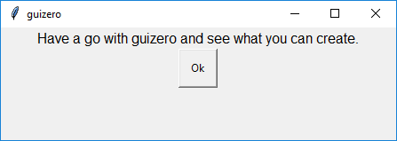

# guizero

[guizero](https://lawsie.github.io/guizero) is a Python 3 library for creating simple GUIs.

It is designed to allow new learners to quickly and easily create GUIs for their programs.



```python
from guizero import App, Text, PushButton

app = App(title="guizero")

intro = Text(app, text="Have a go with guizero and see what you can create.")
ok = PushButton(app, text="Ok")

app.display()
```

## Install

If you can download and unzip a file, you can [install guizero](https://lawsie.github.io/guizero/#easy-install) - **no special permissions or administrator rights are required**.

If you have administrator rights and are connected to the internet, you can use [pip to install guizero](https://lawsie.github.io/guizero/#install-using-pip).

## Documentation

Comprehensive documentation can be found at [lawsie.github.io/guizero](https://lawsie.github.io/guizero) including:
+ [installation instructions](https://lawsie.github.io/guizero)
+ [a getting started guide](https://lawsie.github.io/guizero/start)
+ [recipes](https://lawsie.github.io/guizero/recipes)
+ [an API reference](https://lawsie.github.io/guizero/app/)

## Aims
The aim of guizero is to make the process of creating simple GUIs quick, accessible and understandable for new learners.

* Works with standard Python Tkinter GUI library (and no need to install other libraries)
* Abstracts away details new learners find difficult to understand (such as Tkinter StringVar() objects)
* Accessible widget naming system to help new learners to build up a mental model
* Flexible enough to be used for projects up to A-Level standard, yet accessible to primary school children
* Comprehensive and accessible documentation with examples
* Generates helpful additional error messages

## Contributing

Contributions are very welcome - please see [lawsie.github.io/guizero/contributing](https://lawsie.github.io/guizero/contributing) for notes, build and deployment instructions.

## Issues

All issues should be raised on [github.com/lawsie/guizero/issues](https://github.com/lawsie/guizero/issues)

## Book

The authors of guizero have written a book for beginners which you can [buy in print](https://store.rpipress.cc/products/create-graphical-user-interfaces-with-python) or download as a [free PDF](https://magpi.raspberrypi.org/books/create-guis).
