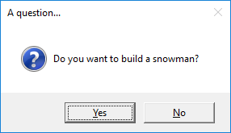
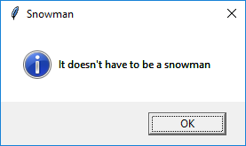

# Alerts

### Using alerts
To use the alerts you will need to import each one individually at the start of your program. For example:

```python
from guizero import warn, info
```

### Purpose
These functions pop up a box on the screen that displays a message. The functions available are:

* `warn(title, text)` - popup box with a warning icon
* `info(title, text)` - popup box with an information icon
* `error(title, text)` - popup box with an error icon
* `yesno(title, text)` - popup box with yes and no options. Pressing `Yes` returns `True` and pressing `No` returns `False`.

All pop up boxes use the native display, so they will look different depending on your operating system.

### Examples

**Warning box**

This will pop up a warning box with the title `"Uh oh!"` and the message `"You are almost out of biscuits!"`.

```python
from guizero import App, warn
app = App(title="Biscuit monitor")
warn("Uh oh!", "You are almost out of biscuits!")
app.display()
```
On Windows, the box looks like this:


The `info` and `error` boxes work in exactly the same way but will display different icons.

**Yes/No box**

When this function is called it returns a **boolean** value.

* If `Yes` was pressed, return `True`
* If `No` was pressed, return `False`

You can store this value in a variable and test it:

```python
from guizero import App, yesno, info, error
app = App(title="Snowman")
build_a_snowman = yesno("A question...", "Do you want to build a snowman?")
if build_a_snowman == True:
    info("Snowman", "It doesn't have to be a snowman")
else:
    error("Snowman", "Okay bye...")
app.display()
```

This code will first display the yes/no box



If `Yes` is pressed, an information box will be displayed:



If `No` is pressed, an error box will be displayed


**Example: Using an alert as a callback**

You can also use these functions in a *callback* (when you have to provide a function for another widget to call). Here is an example with a `PushButton` which pops up an `info` box when it is pressed.

```python
from guizero import App, PushButton, info
app = App()
button = PushButton(app, command=info, args=["Info", "You pressed the button"])
app.display()
```

The arguments provided to the `PushButton` are:

* Where the button should be created (within the `app`)
* The name of the function to call when pressed (`info`)
* A list of the arguments to the function you are calling (values for the `title` and `message` arguments for the `info` function)

**Example: Do you really want to close?**

You can use a `yesno` box to check whether someone really wants to exit your app. If they click yes, the app is closed, if not, nothing happens and they can continue with what they were doing.

```python
from guizero import App, Text, yesno

# Ask the user if they really want to close the window
def do_this_on_close():
    if yesno("Close", "Do you want to quit?"):
        app.destroy()

app = App()

title = Text(app, text="blank app")

# When the user tries to close the window, run the function do_this_on_close()
app.on_close(do_this_on_close)

app.display()

```
