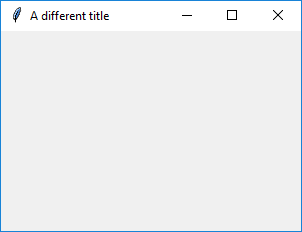
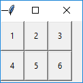

# App

(Extends the `Tk` class from `tkinter`)

### Purpose
The `App` object  is the basis of all GUIs created using guizero. You can imagine it as a container, to which other widgets are added.

```
class guizero.App(title="GUIzero", height=500, width=500, layout="auto", bgcolor=None)
```


### Documentation

Create an App object like this:

```python
app = App()
```

**Parameters**

When creating an `App` object, you can specify the following parameters, all of which are optional. (More information about how to specify parameters can be found in the ['How to...'](./howto/) section.)

| Parameter | Data type | Default | Compulsory | Description                         |
| --------- | --------- | ------- | ---------- | -------------------------|
| title     | string    | "GUIzero" | No       | The title displayed in the bar at the top of the window. |
| height    | int       | 500     | No         | The height of the window in pixels. |
| width     | int       | 500     | No         | The width of the window in pixels.  |
| layout    | string    | "auto"  | No         | Whether widgets pack themselves (`"auto"`) or you specify their position on a grid (`"grid"`) |
| bgcolor    | string    | None  | No         | The background colour of the app window. Takes a RGB Hex colour (e.g. #0099ff) or a known colour string (e.g. "black").  |


**About the 'layout' parameter**

The parameter `layout` allows you to specify whether the widgets in your app are placed automatically (`auto`), or whether you wish to position them yourself on a grid (`grid`). The default layout is `auto`.

If you choose the `grid` layout, this means that when you create a widget you will need to pass the widget an extra parameter called `grid` which is a list containing `[x,y]` coordinates for where you want the widget to appear within the app, like this:

```python
text = Text(app, text="Hello world", grid=[0,1])
```

There is no need to specify the width or height of the grid you want - it will expand depending on the coordinates you provide with each widget. However, grid cells containing no objects will have no height or width.

### Methods summary

You can call the following methods on your App object

| Method        | Takes     | Returns    | Description                |
| ------------- | --------- | ---------- | -------------------------- |
| display()     |-          | -          | Displays the app on the screen. You **MUST** call this method at the end of your program to display the app on the screen. |
| set_title(title)   | title (string)         | -          | Takes a string `title` and displays this in the top bar of the app window        |
| on_close(command)   | command (function name)         | -          | Calls the given function when the user tries to close the window.      |
| destroy   | -         | -          | Closes the app window.    |
| bgcolor   | bgcolor (string)       | -          | Changes the background colour of the window. Takes a RGB Hex colour (e.g. #0099ff) or a known colour string (e.g. "black").   |

### Examples

**Creating an App object**

You can create an `App` object by calling the `App()` constructor. You should give the object a name so you can refer to it later - in this case we have called it `app`.

It is best to keep the name you give to your `App` object quite short, as you will have to use it to tell other widgets where they should be stored.

Then, at the end of the program you **MUST** tell the app object to begin the display loop.

```python
from guizero import App
app = App(title="My app", height=300, width=200)
app.display()
```

**Changing the title**

You can change the title of the app object once it has been created like this:

```python
from guizero import App
app = App(title="My app", height=300, width=200)
app.set_title("A different title")
app.display()
```
This will display the app with the updated title:



**Using grid layout**

You can lay components out in a grid and specify where they appear with grid layout.



```python
from guizero import App, PushButton
def do_nothing():
    print("Nothing happened")

app = App(title="Keypad example", width=100, height=90, layout="grid")
button1 = PushButton(app, command=do_nothing, text="1", grid=[0,0])
button2 = PushButton(app, command=do_nothing, text="2", grid=[0,1])
button3  = PushButton(app, command=do_nothing, text="3", grid=[0,2])
button4  = PushButton(app, command=do_nothing, text="4", grid=[1,0])
button5  = PushButton(app, command=do_nothing, text="5", grid=[1,1])
button6  = PushButton(app, command=do_nothing, text="6", grid=[1,2])
app.display()
```
