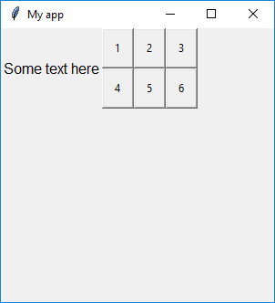

# Box

(Extends the `Frame` class from `tkinter`)

### Purpose
The `Box` object is an invisible container which can contain other widgets. It is the only object other than `App` which can act as the `master` for other objects and can have its own layout manager.

You can use the `Box` object to group other objects within your GUI.

```
class guizero.Box(master, layout="auto", grid=None, align=None)
```


### Documentation

Create a Box object like this:

```python
from guizero import App, Box
app = App()
box = Box(app)
app.display()
```

**Parameters**

When creating a `Box` object, you can specify the following parameters. (More information about how to specify parameters can be found in the ['How to...'](./howto/) section.)

| Parameter | Data type | Default | Compulsory | Description                         |
| --------- | --------- | ------- | ---------- | -------------------------|
| master    | App    | - | Yes       | The `App` object to which this box belongs
| layout   | string    | "auto"  | No         | Whether widgets *inside this box* pack themselves (`"auto"`) or you specify their position on a grid (`"grid"`) |
| grid   | List    | None     | No         | `[x,y]` coordinates of this widget. This parameter is only required if the `master` object has a grid layout. |
| align   | string     | None     | No         | Alignment of this widget within its grid location. Possible values: `"top"`, `"bottom"`, `"left"`, `"right"`. This parameter is only required if the `master` object has a grid layout.  |


**About the 'layout' parameter**

The parameter `layout` allows you to specify whether the widgets inside the box are placed automatically (`auto`), or whether you wish to position them yourself on a grid (`grid`). The default layout is auto.

If you choose the `grid` layout, this means that when you create a widget and set a box as its `master`, you will need to pass the widget an extra parameter called `grid` which is a list containing two coordinates (x,y) for where you want the widget to appear on the grid within the box, like this:

```python
text = Text(box, text="Hello world", grid=[0,1])
```

There is no need to specify the width or height of the grid you want - it will expand depending on the coordinates you provide with each widget. However, grid cells containing no objects will have no height or width.

### Methods summary

There are no methods for the `Box` object

### Examples

**Putting widgets in a Box**

A `Box` object is invisible, but it can contain other widgets. In this example, there are two `Text` objects. One has `box` as its master, the other has `app` as its master.

```python
from guizero import App, Box, Text
app = App(title="My app", height=300, width=200)
box = Box(app)
text1 = Text(box, text="Hello from the box", size=14, color="red", font="Arial")
text2 = Text(app, text="Hello from the app", size=14, color="blue", font="Courier New")
app.display()
```

**Grouping objects within a Box**

It is useful to put objects in a box to group them together. For example here we have given the `app` a grid layout, then placed some text at [0,0] and the `Box` object at [0,1]. This means that the text will appear on the left, and the contents of the Box will appear on the right.

The `Box` object itself has a grid layout and contains six buttons which are positioned on a *separate* grid layout belonging to the box.

```python
from guizero import App, Text, Box, PushButton
def do_nothing():
    return 0

app = App(title="My app", height=300, width=200, layout="grid")
text = Text(app, text="Some text here", grid=[0,0])
box = Box(app, layout="grid", grid=[0,1])
button1 = PushButton(box, command=do_nothing, text="1", grid=[0,0])
button2 = PushButton(box, command=do_nothing, text="2", grid=[0,1])
button3 = PushButton(box, command=do_nothing, text="3", grid=[0,2])
button4 = PushButton(box, command=do_nothing, text="4", grid=[1,0])
button5 = PushButton(box, command=do_nothing, text="5", grid=[1,1])
button6 = PushButton(box, command=do_nothing, text="6", grid=[1,2])
app.display()
```

