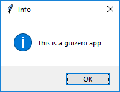
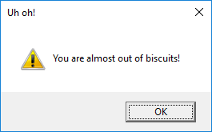
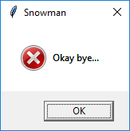
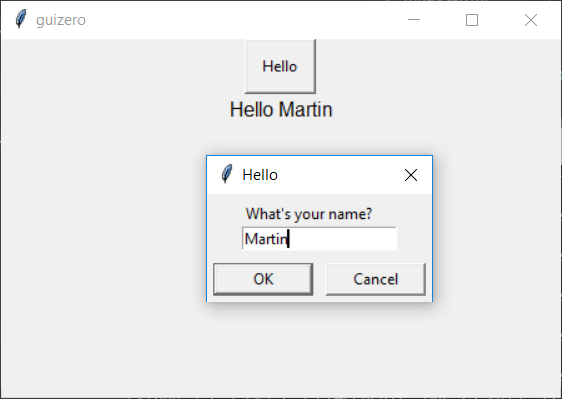
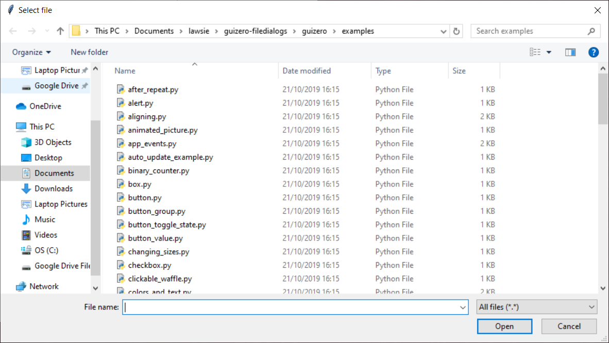
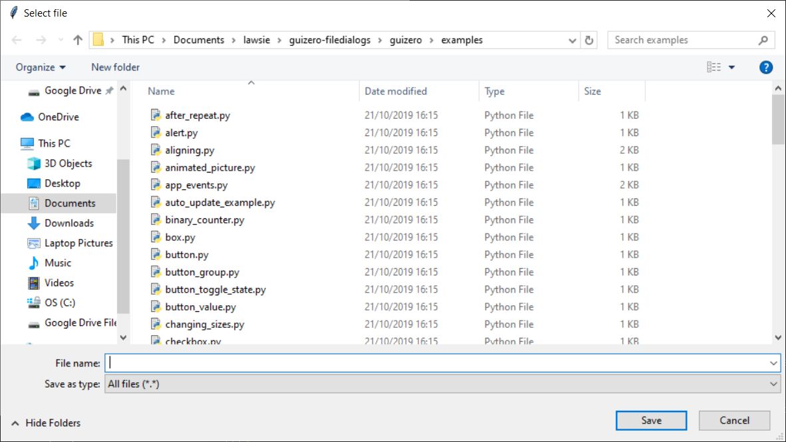

# Pop-ups

Pop-up windows which can be used to interrupt the user by asking question or providing information.



### Using pop-ups
Pop-ups can be called from an `App` or `Window` object, for example:

```python
app.info("info", "this is a guizero app")
```

Pop-ups can also be imported individually at the start of your program, for example:

```python
from guizero import info
info("info", "this is a guizero app")
```

### Purpose
These functions pop up a box on the screen that displays a message or asks a question. The functions available are:

* `warn(title, text)` - popup box with a warning icon
* `info(title, text)` - popup box with an information icon
* `error(title, text)` - popup box with an error icon
* `yesno(title, text)` - popup box with yes and no options. Pressing `Yes` returns `True` and pressing `No` returns `False`.
* `question(title, text, initial_value=None)` - popup box with a question box which can accept a text response. Pressing `Ok` returns value entered into the box is returned and pressing `Cancel` returns `None`.
* `select_file(title="Select file", folder=".", filetypes=[["All files", "*.*"]], save=False, filename="")` - popup file dialog box which asks the user to select a file. By default, an *Open* button is displayed, setting `save` to `True` will change the button to *Save as*. The path of the selected file is returned by the function. A `filename` parameter can be supplied which will auto populate the file name field.
* `select_folder(title="Select folder", folder=".")` - popup box which asks the user to select a folder. The path of the selected folder is returned by the function.
* `select_color(color=None)` - popup box which prompts the user to select a color. Set `color` to an `#rrggbb` to select a default color when the popup opens. Pressing `Ok` returns the select color as a `#rrggbb` value, pressing `Cancel` returns `None`.

All pop up boxes use the native display, so they will look different depending on your operating system.

### Examples

**Warning box**

This will pop up a warning box with the title `"Uh oh!"` and the message `"You are almost out of biscuits!"`.

```python
from guizero import App
app = App(title="Biscuit monitor")
app.warn("Uh oh!", "You are almost out of biscuits!")
app.display()
```
On Windows, the box looks like this:



The `info` and `error` boxes work in exactly the same way but will display different icons.

**Yes/No box**

When this function is called it returns a **boolean** value.

* If `Yes` was pressed, return `True`
* If `No` was pressed, return `False`

You can store this value in a variable and test it:

```python
from guizero import App
app = App(title="Snowman")
build_a_snowman = app.yesno("A question...", "Do you want to build a snowman?")
if build_a_snowman == True:
    app.info("Snowman", "It doesn't have to be a snowman")
else:
    app.error("Snowman", "Okay bye...")
app.display()
```

This code will first display the yes/no box


If `Yes` is pressed, an information box will be displayed:


If `No` is pressed, an error box will be displayed



**Example: Using an alert as a callback**

You can also use these functions in a *callback* (when you have to provide a function for another widget to call). Here is an example with a `PushButton` which pops up an `info` box when it is pressed.

```python
from guizero import App, PushButton, info
app = App()
button = PushButton(app, command=app.info, args=["Info", "You pressed the button"])
app.display()
```

The arguments provided to the `PushButton` are:

* Where the button should be created (within the `app`)
* The name of the function to call when pressed (`info`)
* A list of the arguments to the function you are calling (values for the `title` and `message` arguments for the `info` function)

**Example: Do you really want to close?**

You can use a `yesno` box to check whether someone really wants to exit your app. If they click yes, the app is closed, if not, nothing happens and they can continue with what they were doing.

```python
from guizero import App, Text

# Ask the user if they really want to close the window
def do_this_when_closed():
    if app.yesno("Close", "Do you want to quit?"):
        app.destroy()

app = App()

title = Text(app, text="blank app")

# When the user tries to close the window, run the function do_this_when_closed()
app.when_closed = do_this_when_closed

app.display()

```

**Example: Asking a question**

You can use a `question` pop-up to get information from the user. In this example the user is asked to enter their name when a button is pressed.

```python
from guizero import App, PushButton, Text

def button_pressed():
    name = app.question("Hello", "What's your name?")
    # If cancel is pressed, None is returned
    # so check a name was entered
    if name is not None:
        hello.value = "Hello " + name

app = App()
button = PushButton(app, command=button_pressed, text="Hello")
hello = Text(app)
app.display()
```



** Example: Get a file name**

Ask the user to select a file using the `select_file` pop-up.

```python
from guizero import App, PushButton, Text

def get_file():
    file_name.value = app.select_file()

app = App()

PushButton(app, command=get_file, text="Get file")
file_name = Text(app)

app.display()
```



You can change the file type filter by providing a list of type descriptions and extensions as the `filetypes` parameter e.g.   

```python
file_name.value = app.select_file(filetypes=[["All files", "*.*"], ["Text documents", "*.txt"]])
```

The default is to show an *Open* button, this can be changed to a *Save* button by setting the `save` parameter to `True` e.g.

```python
file_name.value = app.select_file(save=True)
```



** Example: Get a folder name**

Select a folder using the `select_folder` pop-up.

```python
from guizero import App, PushButton, Text

def get_folder():
    path.value = app.select_folder()

app = App()

PushButton(app, command=get_folder, text="Get path")
path = Text(app)

app.display()
```


You can set the initial folder by passing a path to the `folder` parameter    

```python
file_name.value = app.select_file(folder="c:\users\lawsie")
```
