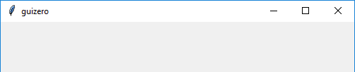
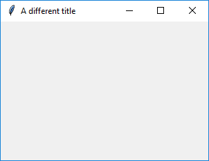

# App

(Contains a `tkinter.Tk` object)

```python
__init__(
    self, 
    title="guizero", 
    width=500, 
    height=500, 
    layout="auto", 
    bgcolor=None, 
    bg=None, 
    visible=True)
```

### What is it?
The `App` object is the basis of all GUIs created using guizero. It is the main window which contains all of the other widgets.



### How do I make one?

Create an `App` object like this:

```python
from guizero import App
app = App()
app.display()
```

### Starting parameters

When you create an `App` object you can specify any of the following parameters, all of which are optional. Specify parameters in the brackets like this: `app = App(bg="red", height=200)`

| Parameter | Data type          | Default   | Compulsory | Description                                                                                      |
|-----------|--------------------|-----------|------------|--------------------------------------------------------------------------------------------------|
| bg        | [color](colors.md) | None      | No         | The background colour of the app window and widgets inside it. Takes a [color](colors.md) value. |
| height    | int                | 500       | No         | The height of the window in pixels.                                                              |
| layout    | string             | "auto"    | No         | Whether widgets pack themselves (`"auto"`) or you specify their position on a grid (`"grid"`)    |
| title     | string             | "guizero" | No         | The title displayed in the bar at the top of the window.                                         |
| width     | int                | 500       | No         | The width of the window in pixels.                                                               |
| visible   | boolean            | True      | No         | If the App should be visible.                                                                    |

### Methods

You can call the following methods on an `App` object.

| Method                                                                                               | Takes                                                                                               | Returns                                                                                           | Description                                                                                                                                                    |
|------------------------------------------------------------------------------------------------------|-----------------------------------------------------------------------------------------------------|---------------------------------------------------------------------------------------------------|----------------------------------------------------------------------------------------------------------------------------------------------------------------|
| add_tk_widget(tk_widget, grid=None, align=None, visible=True, enabled=None, width=None, height=None) | tk_widget (tk), grid (list), align (str), visible (bool), enabled (bool), width (int), height (int) | Widget                                                                                            | Adds a tk widget into a guizero container. Note - this is an advanced feature see [Using tk](usingtk.md) for more information.                                 |
| after(time, command, args=None)                                                                      | time (int), command (function name), args (list of arguments)                                       | -                                                                                                 | Schedules a **single** call to `command` after `time` milliseconds. (To repeatedly call the same command, use `repeat()`)                                      |
| cancel(command)                                                                                      | command (function name)                                                                             | -                                                                                                 | Cancels a scheduled call to `command`                                                                                                                          |
| destroy()                                                                                            | -                                                                                                   | -                                                                                                 | Destroys the widget                                                                                                                                            |
| disable()                                                                                            | -                                                                                                   | -                                                                                                 | Disables all the widgets in the app so that they cannot be interacted with                                                                                     |
| display()                                                                                            | -                                                                                                   | -                                                                                                 | Displays the app on the screen. You **MUST** call this method at the end of your program to display the app on the screen.                                     |
| enable()                                                                                             | -                                                                                                   | -                                                                                                 | Enables all the widgets in the app                                                                                                                             |
| error(title, text)                                                                                   | title (str), text (str)                                                                             | -                                                                                                 | Displays a popup box with an error icon                                                                                                                        |
| exit_full_screen()                                                                                   | -                                                                                                   | -                                                                                                 | Exit full screen display                                                                                                                                       |
| focus()                                                                                              | -                                                                                                   | -                                                                                                 | Gives focus to the widget                                                                                                                                      |
| hide()                                                                                               | -                                                                                                   | -                                                                                                 | Hides the app window from view.                                                                                                                                |
| info(title, text)                                                                                    | title (str), text (str)                                                                             | -                                                                                                 | Displays a popup box with an information icon                                                                                                                  |
| question(title, text, initial_value=None)                                                            | title (str), text (str), initial_value (str)                                                        | Pressing `Ok` returns value entered into the box is returned and pressing `Cancel` returns `None` | Displays a popup box with a question box which can accept a text response                                                                                      |
| repeat(time, command, args=None)                                                                     | time (int), command (function name), args (list of arguments)                                       | -                                                                                                 | Repeats `command` every `time` milliseconds. This is useful for scheduling a function to be regularly called, for example updating a value read from a sensor. |
| select_file(title="Select file", folder=".", filetypes=[["All files", "*.*"]], save=False)           | title (str), folder (str), filetypes (list), save (bool)                                            | Full path of the file selected as a string                                                        | Display a box to select a file to open or save. If Open or Save is pressed the filename path is returned. If Cancel is pressed `None` is returned.             |
| select_folder(title="Select folder", folder=".")                                                     | title (str), folder (str)                                                                           | Full path of the folder selected as a string                                                      | Display a box to select a folder. If a folder is selected the folder path is returned, otherwise `None` is returned.                                           |
| set_full_screen(keybind)                                                                             | String                                                                                              | -                                                                                                 | Set the application to display full screen. Option to specify a key to exit full screen (default is 'Esc'.)                                                    |
| show()                                                                                               | -                                                                                                   | -                                                                                                 | Displays the app window if it was previously hidden                                                                                                            |
| update()                                                                                             | -                                                                                                   | -                                                                                                 | Force the application to update itself, useful if changes aren't reflected in the UI.                                                                          |
| warn(title, text)                                                                                    | title (str), text (str)                                                                             | -                                                                                                 | Displays a popup box with a warning icon                                                                                                                       |
| yesno(title, text)                                                                                   | title (str), text (str)                                                                             | Pressing `Yes` returns `True` and pressing `No` returns `False`                                   | Displays a popup box with yes and no options                                                                                                                   |
| _on_close(command)_                                                                                  | _command (function name)_                                                                           | -                                                                                                 | _Calls the given function when the user tries to close the window._                                                                                            |

Parameters in _italics_ will still work but are **deprecated** - this means you should stop using them because they may not work in future versions of guizero

### Properties

You can set and get the following properties:

| Method      | Data type          | Description                                                                                |
|-------------|--------------------|--------------------------------------------------------------------------------------------|
| bg          | [color](colors.md) | The background colour of the window                                                        |
| children    | list(widgets)      | A list of widgets in this container                                                        |
| enabled     | boolean            | `True` if the app is enabled                                                               |
| height      | int                | The height of the window                                                                   |
| font        | string             | The font that widgets should use                                                           |
| full_screen | boolean            | False                                                                                      |
| layout      | string             | The layout being used by the App (`"auto"`) or (`"grid"`)                                  |
| title       | string             | The title of the window                                                                    |
| text_size   | int                | The size of the text widgets should use                                                    |
| text_color  | [color](colors.md) | The colour of the text widgets should use                                                  |
| visible     | boolean            | If the app is visible                                                                      |
| width       | int                | The width of the window                                                                    |
| when_closed | function           | The function to call when the `App` is closed. Setting to `None` (the default) will reset. |


Refer to a property as `<name of widget>.property`. For example, if your `App` object is called `app` you would write `app.title`.

You can **set** the property (for example `app.title = "Hello world"`) or **get** the value of the property to use (for example `print(app.title)`).

### Examples

**Creating an App object**

Create an `App` object by calling the `App()` constructor. You should give the object a name so you can refer to it later - in this case we have called it `app`. It is best to keep the name you give to your `App` object quite short, as you will have to use it to tell other widgets where they should be stored.

At the end of the program you **MUST** tell the app object to begin the display loop.

```python
from guizero import App
app = App(title="My app", height=300, width=200)
app.display()
```

**Changing the title**

You can change the title of the app object once it has been created like this:

```python
from guizero import App
app = App(title="My app", height=300, width=200)
app.title = "A different title"
app.display()
```
This will display the app with the updated title:


