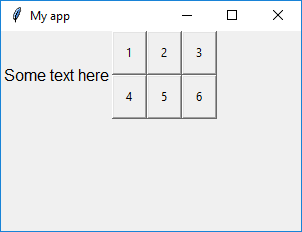

# Box

(Contains a `tkinter.Frame` object)

`__init__(self, master, layout="auto", grid=None, align=None)`

### What is it?
The `Box` object is an invisible container which can contain other widgets. It is the only object other than `App` which can act as the `master` for other objects and can have its own layout manager.

You can use the `Box` object to group other objects within your GUI.

### How do I make one?

Create a `Box` object like this:

```python
from guizero import App, Box
app = App()
box = Box(app)
app.display()
```

### Starting parameters

When you create a `Box` object you **must** specify a master, and you can specify any of the optional parameters. Specify parameters in the brackets like this: `box = Box(app, layout="grid")`

| Parameter | Data type | Default | Compulsory | Description                         |
| --------- | --------- | ------- | ---------- | -------------------------|
| master    | App    | - | Yes       | The `App` object to which this box belongs
| align   | string     | None     | -         | Alignment of this widget within its grid location. Possible values: `"top"`, `"bottom"`, `"left"`, `"right"`. This parameter is only required if the `master` object has a grid layout.  |
| grid   | List    | None     | -         | `[x,y]` coordinates of this widget. This parameter is only required if the `master` object has a grid layout. |
| layout   | string    | "auto"  | -         | Whether widgets *inside this box* pack themselves (`"auto"`) or you specify their position on a grid (`"grid"`) |


### Methods

You can call the following methods on a `Box` object.

| Method        | Takes     | Returns    | Description                |
| ------------- | --------- | ---------- | -------------------------- |
| after(time, command)   | time (int), command (function name)   | -          | Schedules a **single** call to `command` after `time` milliseconds. (To repeatedly call the same command, use `repeat()`)  |
| cancel(command)   | command (function name) | -          | Cancels a scheduled call to `command`    |
| destroy()   | -  | -          | Destroys the widget    |
| focus()  | -  | -          | Gives focus to the widget (e.g. focusing a `TextBox` so that the user can type inside it)  |
| hide()  | -   | -          | Hides the widget from view. This method will unpack the widget from the layout manager.   |
| repeat(time, command)  | time (int), command (function name)  | -          | Repeats `command` every `time` milliseconds. This is useful for scheduling a function to be regularly called, for example updating a value read from a sensor.   |
| show()  | - | -          | Displays the widget if it was previously hidden |


### Properties

You can set and get the following properties:

| Method        | Data type   | Description                |
| ------------- | ----------- | -------------------------- |
| align         | string      | The alignment of this widget within its grid location |
| grid          | List        | `[x,y]` coordinates of this widget. This parameter is only required if the `master` object has a grid |
| layout        | string      | The layout being used by the Box (`"auto"`) or (`"grid"`) |
| master        | App         | The `App` object to which this box belongs |
| visible       | boolean     | If this widget is visible |


### Examples

**Putting widgets in a Box**

A `Box` object is invisible, but it can contain other widgets. In this example, there are two `Text` objects. One has `box` as its master, the other has `app` as its master.

```python
from guizero import App, Box, Text
app = App(title="My app", height=300, width=400)
box = Box(app)
text1 = Text(box, text="Hello from the box", size=14, text_color="red", font="Arial")
text2 = Text(app, text="Hello from the app", size=14, text_color="blue", font="Courier New")
app.display()
```


**Grouping objects within a Box**

It is useful to put objects in a box to group them together. For example here we have given the `app` a grid layout, then placed some text at [0,0] and the `Box` object at [1,0]. This means that the text will appear on the left, and the contents of the Box will appear on the right.

The `Box` object itself has a grid layout and contains six buttons which are positioned on a *separate* grid layout belonging to the box.

```python
from guizero import App, Text, Box, PushButton
def do_nothing():
    return 0

app = App(title="My app", height=300, width=300, layout="grid")
text = Text(app, text="Some text here", grid=[0,0])
box = Box(app, layout="grid", grid=[1,0])
button1 = PushButton(box, command=do_nothing, text="1", grid=[0,0])
button2 = PushButton(box, command=do_nothing, text="2", grid=[1,0])
button3 = PushButton(box, command=do_nothing, text="3", grid=[2,0])
button4 = PushButton(box, command=do_nothing, text="4", grid=[0,1])
button5 = PushButton(box, command=do_nothing, text="5", grid=[1,1])
button6 = PushButton(box, command=do_nothing, text="6", grid=[2,1])
app.display()

```

