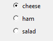

# ButtonGroup

(Contains a `tkinter.Frame` object)

`__init__(self, master, options, selected, horizontal=False, command=None, grid=None, align=None)`

### What is it?
The `ButtonGroup` object displays a group of radio buttons, allowing the user to choose a single option.



### How do I make one?

Create a `ButtonGroup` object like this:

```python
from guizero import App, ButtonGroup
app = App()
choice = ButtonGroup(app, options=["cheese", "ham", "salad"], selected=1)
app.display()
```

### Starting parameters

When you create a `ButtonGroup` object you **must** specify `master`, `options` and `selected` and you can specify any of the optional parameters. Specify parameters in the brackets like this: `choice = ButtonGroup(app, options=["cheese", "ham", "salad"], selected=1)`

| Parameter | Takes | Default | Compulsory | Description                         |
| --------- | --------- | ------- | ---------- | -------------------------|
| master    | App or Box   | - | Yes       | The container to which this widget belongs
| options   | list or 2D List   | -  | Yes         | Either a list or a 2D list of [text, value] pairs. If a 2D list is specified, the first item in the pair will be displayed on the interface, and the second item will be a hidden value associated with this option. If a list is specified, the options will be automatically numbered with hidden values, beginning at 1. |
| selected   | string    | -     | Yes       | The option that should be selected. If the options are specified as a list, the selected option should be the number of the desired option, beginning at 1. If a 2D list is specified, this should be the **hidden value** associated with one of the options. |
| align   | string     | None     | -         | Alignment of this widget within its grid location. Possible values: `"top"`, `"bottom"`, `"left"`, `"right"`. This parameter is only required if the `master` object has a grid layout.  |
| command | function name | None | -   | The name of a function to call when the selected option changes. |
| grid   | list [int, int]   | None     | -         | `[x,y]` coordinates of this widget. This parameter is only required if the `master` object has a grid layout. |
| horizontal   | boolean    | False     | -       | Whether the buttons stack vertically or horizontally. (Defaults to vertical)|

### Methods

You can call the following methods on an `ButtonGroup` object.

| Method        | Takes     | Returns    | Description                |
| ------------- | ------------- | ---------- | -------------------------- |
| after(time, command)   | time (int), command (function name)   | -          | Schedules a **single** call to `command` after `time` milliseconds. (To repeatedly call the same command, use `repeat()`)  |
| cancel(command)   | command (function name) | -          | Cancels a scheduled call to `command`    |
| destroy()   | -  | -          | Destroys the widget    |
| focus()  | -  | -          | Gives focus to the widget   |
| get_group_as_list() | - | list |  Returns a list containing all of the text/hidden value pairs from the ButtonGroup (useful for debugging) |
| hide()  | -   | -          | Hides the widget from view. This method will unpack the widget from the layout manager.   |
| repeat(time, command)  | time (int), command (function name)  | -          | Repeats `command` every `time` milliseconds. This is useful for scheduling a function to be regularly called, for example updating a value read from a sensor.   |
| show()  | - | -          | Displays the widget if it was previously hidden |
| _get()_  | -  | _string_          | _Replaced by `value` property_ |
| _set(value)_   | _value (string)_            | -          | _Replaced by `value` property_        |


Parameters in _italics_ will still work but are **deprecated** - this means you should stop using them because they may not work in future versions of guizero

### Properties

You can set and get the following properties:

| Method        | Data type   | Description                |
| ------------- | ----------- | -------------------------- |
| align         | string      | The alignment of this widget within its grid location |
| grid          | List        | `[x,y]` coordinates of this widget. This parameter is only required if the `master` object has a grid |
| master        | App or Box  | The container to which this widget belongs |
| value         | string      | The hidden value associated with the currently selected option   |
| value_text    | string      | The text associated with the currently selected option   |
| visible       | boolean     | If this widget is visible |

Refer to a property as `<name of widget>.property`. For example, if your `ButtonGroup` object is called `choice` you would write `choice.value`.

You can **set** the property (for example `choice.value = "2"`) or **get** the value of the property to use (for example `print(choice.value)`).

### Examples

**Creating a ButtonGroup with a 2D list**

If you want to create a ButtonGroup object with your own hidden values you can specify a 2D list of options:

```python
from guizero import App, ButtonGroup, Text

def update_text():
    what_is_selected.value = activities.value

app = App()
activities = ButtonGroup(app, options=[
                              ["Roller Skating", "skate"],
                              ["White water rafting", "WWR"],
                              ["Mountain climbing", "climb"]
                            ],
                            selected="skate", command=update_text)

what_is_selected = Text(app, text="skate")
app.display()
```
