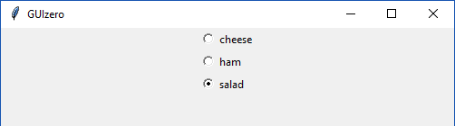

# ButtonGroup

(Extends the `Frame` class from `tkinter`)

### Purpose
Display a group of radio buttons to allow the user to choose an option

```
class guizero.ButtonGroup(master, options, horizontal=False, command=None, grid=None, align=None)
```

### Create a ButtonGroup object

Create a basic ButtonGroup object like this:

```python
app = App()
choice = ButtonGroup(app,
                         [["cheese", 0],
                          ["ham", 1],
                          ["salad", 2]],
                     2)
app.display()

```

The `options` parameter takes a 2D list (a list of lists) of options to display. The numerical values in this example are hidden, but will be returned by the method `get()`. **All items provided in the options list will be autmatically converted to strings when added to the ButtonGroup.**

The code above will look like this on Windows:




When creating a ButtonGroup object, you can specify the following parameters. (More information about how to specify parameters can be found in the ['How to...'](./howto/) section.)

| Parameter | Takes | Default | Compulsory | Description                         |
| --------- | --------- | ------- | ---------- | -------------------------|
| master    | App or Box   | - | Yes       | The container to which this widget belongs
| options   | 2D List    | -  | Yes         | A two dimensional list of [text, value] pairs. The first item in the pair will be displayed on the interface, and the second item will be a hidden value associated with this option. |
| selected   | string    | -     | Yes       | The option that is selected. This should be the **hidden value** and NOT the text. |
| horizontal   | Boolean    | False     | No       | Whether the buttons stack vertically or horizontally. (Defaults to vertical.)|
| command | function name | None | No   | The name of a function to call when a different option is selected. |
| grid   | List [int, int]   | None     | No         | `[x,y]` coordinates of this widget. This parameter is only required if the `master` object has a grid layout. |
| align   | string     | None     | No         | Alignment of this widget within its grid location. Possible values: `"top"`, `"bottom"`, `"left"`, `"right"`. This parameter is only required if the `master` object has a grid layout.  |


### Methods

You can call the following methods on your ButtonGroup object

| Method        | Takes     | Returns    | Description                |
| ------------- | ------------- | ---------- | -------------------------- |
| get()  | -  | string          | Returns the **hidden value** associated with the selected option (NOT the text associated with the option) |
| set(value)   | value (string)            | -          | Sets the selected option to the option with the string `value` as its **hidden value**           |
| get_group_as_list() | - | List |  Returns a list containing all of the text/hidden value pairs from the ButtonGroup (useful for debugging) |


### Examples

**Creating a ButtonGroup**

The simplest way to create a ButtonGroup object is as follows:

```python
app = App()
activties = ButtonGroup(app, [
                              ["Roller Skating", "skate"],
                              ["White water rafting", "WWR"],
                              ["Mountain climbing", "climb"]
                            ],
                             "skate")
app.display()
```
