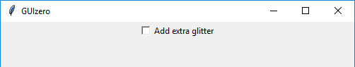
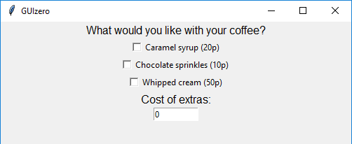

# CheckBox

(Contains a `tkinter.Checkbutton` object)

`__init__(self, master, text, command=None, grid=None, align=None)`

### What is it?
The `CheckBox` object displays a check box to allow an option to be ticked or unticked



### How do I make one?

Create a `CheckBox` object like this:

```python
from guizero import App, CheckBox
app = App()
checkbox = CheckBox(app, text="Add extra glitter")
app.display()
```

### Starting parameters

When you create a `CheckBox` object you **must** specify `master` and `text` and you can specify any of the optional parameters. Specify parameters in the brackets, like this: `checkbox = CheckBox(app, text="Add extra glitter")`

| Parameter | Takes | Default | Compulsory | Description                         |
| --------- | --------- | ------- | ---------- | -------------------------|
| master    | App or Box   | - | Yes       | The container to which this widget belongs
| text   | string    | -  | Yes         | The text to display next to the check box |
| align   | string     | None     | -         | Alignment of this widget within its grid location. Possible values: `"top"`, `"bottom"`, `"left"`, `"right"`. This parameter is only required if the `master` object has a grid layout.  |
| command | function name | None | -   | The name of a function to call when this checkbox is ticked/unticked |
| grid   | List [int, int]   | None     | -         | `[x,y]` coordinates of this widget. This parameter is only required if the `master` object has a grid layout. |


### Methods

You can call the following methods on a `CheckBox` object.

| Method        | Takes     | Returns    | Description                |
| ------------- | ------------- | ---------- | -------------------------- |
| after(time, command)   | time (int), command (function name)   | -          | Schedules a **single** call to `command` after `time` milliseconds. (To repeatedly call the same command, use `repeat()`)  |
| cancel(command)   | command (function name) | -          | Cancels a scheduled call to `command`    |
| destroy()   | -  | -          | Destroys the widget    |
| disable()  | - | -          | Disables the widget so that it is "greyed out" and cannot be interacted with   |
| enable()  | -  | -          | Enables the widget   |
| focus()  | -  | -          | Gives focus to the widget |
| hide()  | -   | -          | Hides the widget from view. This method will unpack the widget from the layout manager.   |
| repeat(time, command)  | time (int), command (function name)  | -          | Repeats `command` every `time` milliseconds. This is useful for scheduling a function to be regularly called, for example updating a value read from a sensor.   |
| show()  | - | -          | Displays the widget if it was previously hidden  |
| toggle() | - | - |  Switches the `CheckBox` to the opposite of its current value. i.e. if it is ticked, untick it and vice versa |
| _change_text(newtext)_ | _newtext (string)_ | - |  _Replaced by the `text` property_ |
| _get_text()_  | -  | _string_          | _Replaced by the `text` property_ |
| _get_value()_   | -         | _int_         | _Replaced by the `value` property_          |


Methods in _italics_ will still work but are **deprecated** - this means you should stop using them because they may not work in future versions of guizero

### Properties

You can set and get the following properties:

| Method        | Data type   | Description                |
| ------------- | ----------- | -------------------------- |
| align         | string      | The alignment of this widget within its grid location |
| enabled       | boolean     | `True` if the widget is enabled |
| grid          | List        | `[x,y]` coordinates of this widget. This parameter is only required if the `master` object has a grid |
| master        | App or Box  | The container to which this widget belongs |
| text    | string        | The text associated with the checkbox   |
| value         | int      | `1` if the CheckBox is ticked or `0` if it is not ticked   |
| visible       | boolean     | If this widget is visible |


Refer to a property as `<name of widget>.property`. For example, if your `CheckBox` object is called `checkbox` you would write `checkbox.value`.

You can **set** the property (for example `checkbox.value = 1`) or **get** the value of the property to use (for example `print(checkbox.value)`).

### Examples

**Creating multiple CheckBoxes**

Create multiple CheckBoxes like this.

```python
from guizero import App, CheckBox
app = App()
glitter = CheckBox(app, text="Add glitter")
sparkles = CheckBox(app, text="Add sparkles")
app.display()
```
**Calling a function when a CheckBox value changes**

You can call a function when the value of a CheckBox changes (becomes checked or unchecked). In this particular example all three CheckBoxes call the same function, but it is possible for each CheckBox object to call a different function.

```python
from guizero import App, Text, CheckBox, TextBox
def calculate_extras():
    total = 0
    if syrup.value == 1:
        total += 20
    if sprinkles.value == 1:
        total += 10
    if cream.value == 1:
        total += 50
    cost.value = total


app = App()

questions = Text(app, text="What would you like with your coffee?")

syrup = CheckBox(app, text="Caramel syrup (20p)", command=calculate_extras)
sprinkles = CheckBox(app, text="Chocolate sprinkles (10p)", command=calculate_extras)
cream = CheckBox(app, text="Whipped cream (50p)", command=calculate_extras)

cost_of_extras = Text(app, text="Cost of extras:")
cost = TextBox(app, text="0")

app.display()
```

