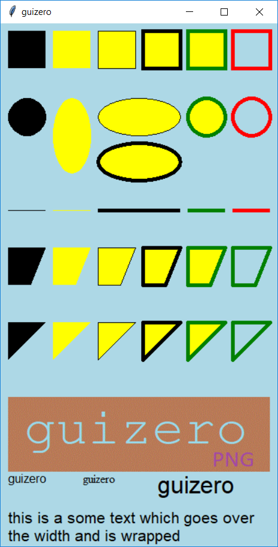
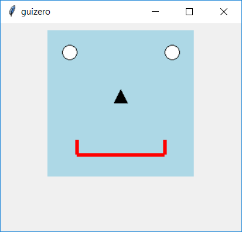

# Drawing

```python
__init__(
    self, 
    master, 
    width=100, 
    height=100, 
    grid=None, 
    align=None, 
    visible=True, 
    enabled=None)
```

### What is it?
The `Drawing` object allows shapes, images and text to be created.



### How do I make one?

Create a `Drawing` object and draw a blue rectangle 50x50 pixels like this:

```python
from guizero import App, Drawing
app = App()
drawing = Drawing(app)
drawing.rectangle(10, 10, 60, 60, color="blue")
app.display()
```

### Starting parameters

When you create a `Drawing` object you **must** specify `master` and you can specify any of the optional parameters. Specify parameters in the brackets, like this: `drawing = Drawing(app, height=300, width=300)`

| Parameter | Takes              | Default | Compulsory | Description                                                                                                     |
|-----------|--------------------|---------|------------|-----------------------------------------------------------------------------------------------------------------|
| master    | App, Window or Box | -       | Yes        | The container to which this widget belongs                                                                      |
| width     | [size](size.md)    | None    | No         | Set the width of the widget in characters or to `"fill"`                                                        |
| height    | [size](size.md)    | None    | No         | Set the height of the widget in characters or to `"fill"`                                                       |
| grid      | List [int, int]    | None    | -          | `[x,y]` coordinates of this widget. This parameter is only required if the `master` object has a grid layout.   |
| align     | string             | None    | -          | Alignment of this widget within its container. Possible values: `"top"`, `"bottom"`, `"left"`, `"right"`.       |
| visible   | boolean            | True    | No         | If the widget should be visible.                                                                                |
| enabled   | boolean            | None    | No         | If the widget should be enabled. If `None` (the default) the enabled property will be inherited from the master |


### Methods

You can call the following methods on a `Drawing` object.

| Method                                                                                | Takes                                                                                                       | Returns | Description                                                                                                                                                    |
|---------------------------------------------------------------------------------------|-------------------------------------------------------------------------------------------------------------|---------|----------------------------------------------------------------------------------------------------------------------------------------------------------------|
| after(time, command, args=None)                                                       | time (int), command (function name), args (list of arguments)                                               | -       | Schedules a **single** call to `command` after `time` milliseconds. (To repeatedly call the same command, use `repeat()`)                                      |
| cancel(command)                                                                       | command (function name)                                                                                     | -       | Cancels a scheduled call to `command`                                                                                                                          |
| clear()                                                                               | -                                                                                                           | -       | Clears the drawing                                                                                                                                             |
| delete()                                                                              | id (int) -                                                                                                  | -       | Deletes an "object" (line, triangle, image, etc) from the drawing.                                                                                             |
| destroy()                                                                             | -                                                                                                           | -       | Destroys the widget                                                                                                                                            |
| disable()                                                                             | -                                                                                                           | -       | Disables the widget so that it is "greyed out" and cannot be interacted with                                                                                   |
| enable()                                                                              | -                                                                                                           | -       | Enables the widget                                                                                                                                             |
| focus()                                                                               | -                                                                                                           | -       | Gives focus to the widget                                                                                                                                      |
| hide()                                                                                | -                                                                                                           | -       | Hides the widget from view. This method will unpack the widget from the layout manager.                                                                        |
| image(self, x, y, image, width=None, height=None):                                    | x (int), y (int), image (str), width (int), height (int)                                                    | Id      | Inserts an image into the drawing at the specified position and returns the id of the image created.                                                           |
| line(x1, y1, x2, y2, color="black", width=1)                                          | x1 (int), y1 (int), x2 (int), y2 (int), color (str), width (int)                                            | Id      | Draws a line between 2 points and returns the id of the line created.                                                                                          |
| oval(x1, y1, x2, y2, color="black", outline=False, outline_color="black")             | x1 (int), y1 (int), x2 (int), y2 (int), color (str), outline (int), outline_color (str)                     | Id      | Draws an oval between 2 points and returns the id of the shape created.                                                                                        |
| polygon(*coords, color="black", outline=False, outline_color="black")                 | coords (list int), color (str), outline (int), outline_color (str)                                          | Id      | Draws a polygon between any number of coordinates passed as pairs of x, y and returns the id of the shape created.                                             |
| rectangle(x1, y1, x2, y2, color="black", outline=False, outline_color="black")        | x1 (int), y1 (int), x2 (int), y2 (int), color (str), outline (int), outline_color (str)                     | Id      | Draws a rectangle between 2 points and returns the id of the shape created.                                                                                    |
| repeat(time, command, args=None)                                                      | time (int), command (function name), args (list of arguments)                                               | -       | Repeats `command` every `time` milliseconds. This is useful for scheduling a function to be regularly called, for example updating a value read from a sensor. |
| resize(width, height)                                                                 | width (int), height (int)                                                                                   | -       | Sets the width and height of the widget                                                                                                                        |
| show()                                                                                | -                                                                                                           | -       | Displays the widget if it was previously hidden                                                                                                                |
| text(x, y, text, color="black", font=None, size=None, max_width=None)                 | x (int), y (int), text (str), color (str), font (str), size (str), max_width (int)                          | Id      | Inserts text into the drawing at the specified position and returns the id of the shape created.                                                               |
| triangle(x1, y1, x2, y2, x3, y3, color="black", outline=False, outline_color="black") | x1 (int), y1 (int), x2 (int), y2 (int), x3 (int), y3 (int), color (str), outline (int), outline_color (str) | Id      | Draws a triangle between 3 points and returns the id of the shape created.                                                                                     |
| update_command(command)                                                               | command (function name)                                                                                     | -       | Updates the function to call when a different option is selected.                                                                                              |


### Properties

You can set and get the following properties:

| Method  | Data type          | Description                                                                                           |
|---------|--------------------|-------------------------------------------------------------------------------------------------------|
| align   | string             | The alignment of this widget within its container                                                     |
| bg      | [color](colors.md) | The background colour of the widget                                                                   |
| enabled | boolean            | `True` if the widget is enabled                                                                       |
| grid    | List               | `[x,y]` coordinates of this widget. This parameter is only required if the `master` object has a grid |
| height  | [size](size.md)    | Set the height of the widget in characters or to `"fill"`                                             |
| master  | App or Box         | The container to which this widget belongs                                                            |
| tk      | tkinter.canvas     | The internal tkinter object, see [Using tkinter](usingtk.md)                                          |
| visible | boolean            | If this widget is visible                                                                             |
| width   | [size](size.md)    | Set the width of the widget in characters or to `"fill"`                                              |


Refer to a property as `<name of widget>.property`. For example, if your `Drawing` object is called `drawing` you would write `drawing.bg`.

You can **set** the property (for example `drawing.bg = "blue"`) or **get** the value of the property to use (for example `print(drawing.bg)`).

### Examples

** Draw a robot face **

Use a rectangle for the face, ovals for the eyes, a triangle for the nose and lines for the mouth. 

```python
from guizero import App, Drawing

a = App()

# create drawing object
d = Drawing(a, width=220, height=220)
d.rectangle(10, 10, 210, 210, color="light blue")
d.oval(30, 30, 50, 50, color="white", outline=True)
d.oval(170, 30, 190, 50, color="white", outline=True)
d.triangle(110, 90, 120, 110, 100, 110, color="black")
d.line(50, 180, 50, 160, color="red", width=5)
d.line(50, 180, 170, 180, color="red", width=5)
d.line(170, 180, 170, 160, color="red", width=5)

a.display()
```

