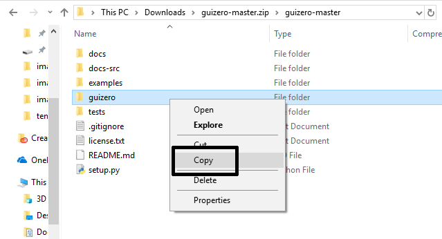
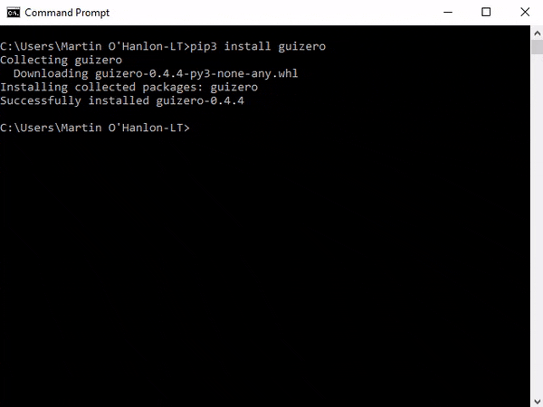
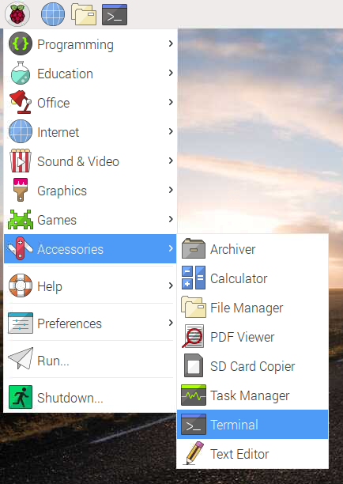
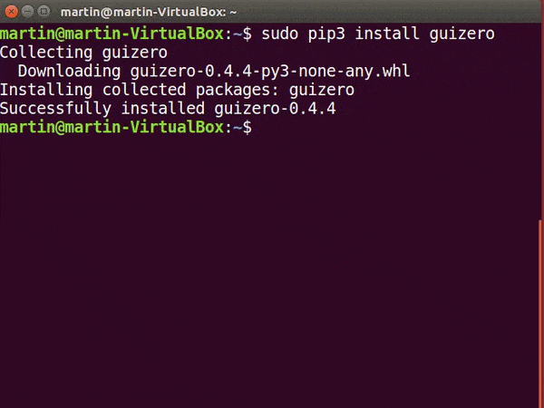
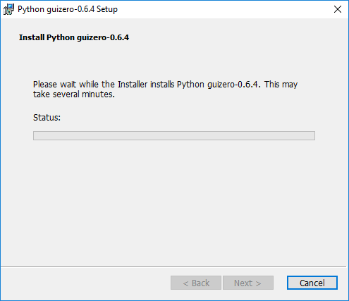

# Installation

guizero is designed to allow new learners to quickly and easily create GUIs for their programs.

If you can download and unzip a file, you can [install guizero](#easy-install) - **no special permissions or administrator rights are required**.

If you have administrator rights and are connected to the internet, you can use [pip to install or upgrade guizero](#install-using-pip) (recommended).

Windows users can also use the [Windows MSI installer](#windows-msi-installer).

## Easy install

1. Go to the [guizero repository](https://github.com/lawsie/guizero) on GitHub.

2. Click the green "Code" button and then "Download ZIP"

    

3. Open the zip file

4. Open the `guizero-master` folder, then copy the `guizero` folder and paste it into your home directory

    + Windows

        

    + macOS

        

5. That's it! When you write your guizero code, make sure you save it into your home directory.

## Install using pip

You can use the command prompt and `pip` to install guizero for:

+ [Windows](#windows)
+ [macOS](#macos)
+ [Raspberry Pi](#raspberry-pi)
+ [Linux](#linux)

`pip` can also be used to [install additional features](#additional-features-install) and [upgrade guizero](#upgrading).

### Windows

1. Open a command prompt by clicking **Start** > **Windows System** > **Command Prompt**, or by typing 'command' into the start menu's search bar.

    

2. Type this command and press enter:

    ```
    pip3 install guizero
    ```



If you experience problems, have a look at this guide to [_Using pip on Windows_](https://projects.raspberrypi.org/en/projects/using-pip-on-windows).

### macOS

1. Open a terminal window by clicking **Applications** > **Utilities** > **Terminal**, or by typing 'terminal' into the desktop's search bar.

    

2. Type this command and press enter:

    ```
    pip3 install guizero
    ```

    

### Raspberry Pi

1. Open a terminal window by clicking **Menu** > **Accessories** > **Terminal**.

    

2. Type this command and press enter:

    ```
    sudo pip3 install guizero
    ```

    

### Linux

1. Open a terminal
2. Install `tkinter` using your distribution's package manager, e.g. `sudo apt install python3-tk`
3. Install guizero using pip by typing `pip3 install guizero` or `sudo pip3 install guizero` if you don't have superuser rights

    

**Note:** If you are using Debian, you alternatively have the option to install guizero via apt
`sudo apt-get install python-guizero`

### Install additional features

To use the additional [image features](images.md) of guizero such as:

- JPG image support
- scaling images
- animated gifs

... you will need to install guizero with the pip command:

- Windows / macOS

    ```
    pip3 install guizero[images]
    ```

- Linux / Raspberry Pi

    ```
    sudo pip3 install guizero[images]
    ```

The additional image features are not available to install using the easy install method.

### Upgrading guizero

If you installed guizero using pip, you can upgrade guizero using a pip command:

- Windows / macOS

    ```
    pip3 install guizero --upgrade
    ```

- Linux / Raspberry Pi

    ```
    sudo pip3 install guizero --upgrade
    ```

If you installed guizero using the easy install method, to upgrade you should follow the same easy installation steps to download the latest version of guizero, then delete the old guizero folder and replace it with the newest version.

## Windows MSI installer

If you are using Windows you can install guizero by downloading and running a Windows MSI installer application.

1. Download either the [64-bit guizero installer](https://github.com/lawsie/guizero/releases/latest/download/guizero-1.2.0.amd64.msi) or the [32-bit guizero installer](https://github.com/lawsie/guizero/releases/latest/download/guizero-1.2.0.win32.msi) depending on which version of Python you are using.

    **Note:** If you are not sure what version of python you are running, run the following program in Python, which will output either `32` or `64`:

        import struct
        print(struct.calcsize("P") * 8)

2. Run the guizero installer and select whether guizero should be installed ***for all users*** or ***just for me*** and click **Next**.

    

3. Select which version(s) of Python you want to install guizero for and click **Next**.

    

    **Note:** For most people, there will be only one version of Python and you can safely choose the default option.

4. You may be asked *"Do you wish to allow this application from an unknown publisher to make changes to your device?"* - click **Yes**.

5. Wait while guizero is installed.

    

6. Click **Finish** when the installation is complete.

    
