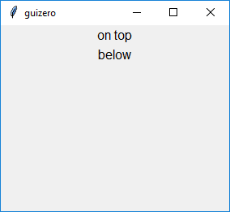
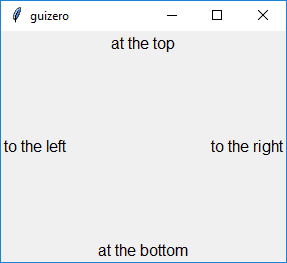
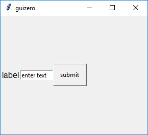
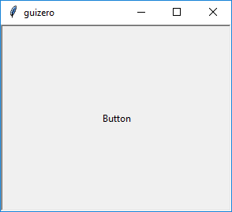
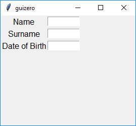
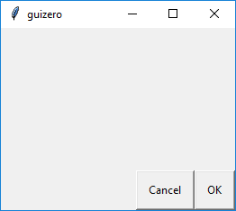
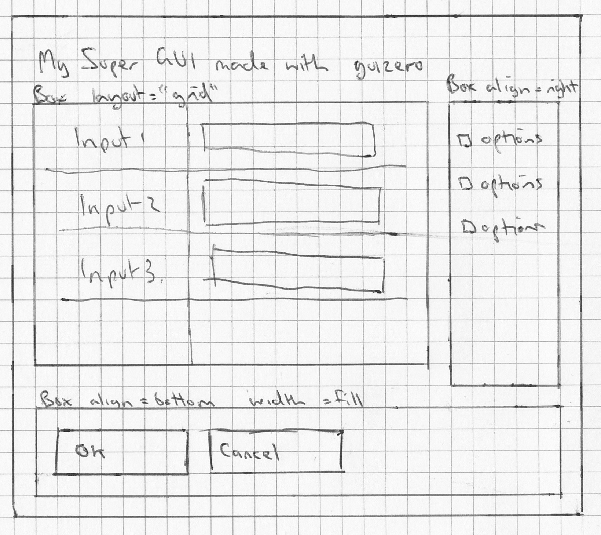

## Layouts

The layout of your GUI is how you arrange the widgets in the window.

Widgets can be arranged into "containers" (e.g. `App`, `Window`, `Box`) using either of these layouts:
+ `auto` - where widgets are positioned automatically
+ `grid` - you specify where in a grid each widget should be positioned

The layout is set using `layout` parameter of the container e.g.

```python
app = App(layout="auto")
app = App(layout="grid")
```

If a `layout` parameter isn't specified the default `auto` is used.

### Auto layout

`auto` is the default layout used when a container is created and will arrange widgets in the order they are created aligned to the centre, e.g. the following code will create 2 Text widgets one on top of the other.

```python
from guizero import App, Text
app = App()
text_1 = Text(app, text="on top")
text_2 = Text(app, text="below")
app.display()
```



### Aligning

Widgets can be aligned to either the `top`, `bottom`, `left` or `right`, using the `align` property when created. 

Aligning Widgets will cause them to be "stuck" to that side of the container e.g. 

```python
from guizero import App, Text
app = App()
top_text = Text(app, text="at the top", align="top")
bottom_text = Text(app, text="at the bottom", align="bottom")
left_text = Text(app, text="to the left", align="left")
right_text = Text(app, text="to the right", align="right")
app.display()
```



By aligning multiple widgets to the same side of the container, widgets can be made to stack together e.g.

```python
from guizero import App, Text, TextBox, PushButton
app = App()
text = Text(app, text="label", align="left")
text_box = TextBox(app, text="enter text", align="left")
button = PushButton(app, text="submit", align="left")
app.display()
```



### Filling

Widgets can also be made to "fill" all the available space by setting the `width` and `height` parameters to `fill`.

e.g.

A TextBox could span the entire width of the container:

```python
from guizero import App, TextBox
app = App()
text_box = TextBox(app, text="enter text", width="fill")
app.display()
```


Or a ListBox could fill the left hand side by using `fill` for the `height` and `align` to the `left` e.g.

```python
from guizero import App, ListBox
app = App()
list_box = ListBox(app, items=["a list"], height="fill", align="left")
app.display()
```


Using `fill` for the `width` and the `height` will make a widget use all the available space e.g.

```python
from guizero import App, PushButton
app = App()
button = PushButton(app, width="fill", height="fill")
app.display()
```



When multiple widgets use `fill` the Window Manager (operating system) will distribute the space accordingly between all the widgets which need to fill it.

```python
from guizero import App, ListBox, PushButton
app = App()
list_box = ListBox(app, items=["a list"], height="fill", align="left")
button = PushButton(app, width="fill", height="fill", align="right")
app.display()
```


**Note :** using fill may not always have the effect you are expecting as it is up to the operating system to distribute screen space.

## Grid layout

The `grid` layout allows you to position widgets into a virtual. 

When you create a widget you will need to pass an extra parameter called `grid` which is a list containing `[x,y]` coordinates for where you want the widget to appear, like this:

```python
app = App(layout="grid")
text = Text(app, text="Hello world", grid=[0,1])
```

There is no need to specify the width or height of the grid you want - it will expand depending on the coordinates you provide with each widget. However, grid cells containing no objects will have no height or width.

This is really useful when creating GUIs where you want widgets to line up. 

e.g. 

Creating a form:



```python
from guizero import App, Text, TextBox

app = App(layout="grid")

name_label = Text(app, text="Name", grid=[0,0])
name = TextBox(app, grid=[1,0])
surname_label = Text(app, text="Surname", grid=[0,1])
surname = TextBox(app, grid=[1,1])
dob_label = Text(app, text="Date of Birth", grid=[0,2])
dob = TextBox(app, grid=[1,2])

app.display()
```

Or a number keypad:


```python
from guizero import App, PushButton

app = App(layout="grid")

button1 = PushButton(app, text="1", grid=[0,0])
button2 = PushButton(app, text="2", grid=[1,0])
button3  = PushButton(app, text="3", grid=[2,0])
button4  = PushButton(app, text="4", grid=[0,1])
button5  = PushButton(app, text="5", grid=[1,1])
button6  = PushButton(app, text="6", grid=[2,1])
button7  = PushButton(app, text="7", grid=[0,2])
button8  = PushButton(app, text="8", grid=[1,2])
button9  = PushButton(app, text="9", grid=[2,2])
button0  = PushButton(app, text="0", grid=[1,3])

app.display()
```

### Spanning columns or rows**

Widgets can be made to span multiple columns or rows by specifying the span within the grid parameter. These are optional, but if specified both must be included using the format `[x,y,xspan,yspan]`.

The example below shows text widget located at 0,1 spanning two columns (x) and one row (y):

```python
text = Text(app, text="Hello world", grid=[0,1,2,1])
```

This can be used to include widgets of different sizes arranged alongside each other.

```python
from guizero import App, Picture

app = App(layout="grid")

picture1 = Picture(app, image="std1.gif", grid=[0,0])
picture2 = Picture(app, image="std2.gif", grid=[1,0])
picture3 = Picture(app, image="tall1.gif", grid=[2,0,1,2])
picture4 = Picture(app, image="wide1.gif", grid=[0,1,2,1])

app.display()
```


## Boxes

By using `Box`es you can segment your GUI into different sections allowing you to layout your user interface any way you want.


[code](https://github.com/lawsie/guizero/tree/master/examples/layout_boxes.py)

If you wanted to create a title in the top left hand corner of your GUI, you could use a `Box` which fills the top of the `App` and put a `Text` widget inside aligned to the `left`.

```python
from guizero import App, Box, Text
app = App()

title_box = Box(app, width="fill", align="top")
title = Text(title_box, text="title", align="left")

app.display()
```


You find it easier to design your layout if your Boxes have borders, which can be done by setting the `border` property on `Box` to `True`.

```python
title_box.border = True
```


A similar method can be used to put "Ok" and "Cancel" buttons which at the bottom right of the GUI.

```python
from guizero import App, Box, PushButton
app = App()

buttons_box = Box(app, width="fill", align="bottom")
ok = PushButton(buttons_box, text="OK", align="right")
cancel = PushButton(buttons_box, text="Cancel", align="right")

app.display()
```



**Note :** A `Box` can also be contained in a `Box`, allowing you to layer boxes and position your widgets.

**Tip :** When creating a GUI you may find it easier to design it first on paper, noting where your boxes will be positioned.


