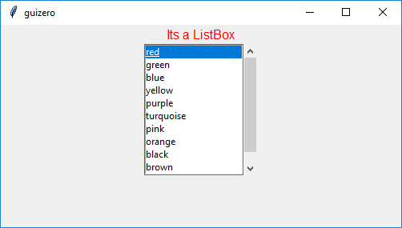

# ListBox

```python
__init__(
    self,
    master,
    items=None,
    selected=None,
    command=None,
    grid=None,
    align=None,
    visible=True,
    enabled=None,
    multiselect=False,
    scrollbar=False,
    width=None,
    height=None)
```

### What is it?
The `ListBox` object displays a list of items from which either single or multiple items can be selected.


### How do I make one?

Create a `ListBox` object like this:

```python
from guizero import App, ListBox
app = App()
listbox = ListBox(app, items=["Beef", "Chicken", "Fish", "Vegetarian"])
app.display()
```

### Starting parameters

When you create a `ListBox` object you **must** specify `master` and you can specify any of the optional parameters. Specify parameters in the brackets, like this: `listbox = ListBox(app, items=["Beef", "Chicken", "Fish", "Vegetarian"])`

If you want the `ListBox` to allow multiple items to be selected you must set the `multiselect` optional parameter to `True`: `listbox = ListBox(app, multiselect=True)`

| Parameter   | Takes              | Default | Compulsory | Description                                                                                                                                                                                                 |
|-------------|--------------------|---------|------------|-------------------------------------------------------------------------------------------------------------------------------------------------------------------------------------------------------------|
| master      | App, Window or Box | -       | Yes        | The container to which this widget belongs                                                                                                                                                                  |
| selected    | string or List     | None    | No         | The item or items to select by default                                                                                                                                                                      |
| items       | List               | -       | Yes        | A list of items to display                                                                                                                                                                                  |
| align       | string             | None    | -          | Alignment of this widget within its container. Possible values: `"top"`, `"bottom"`, `"left"`, `"right"`.                                                                                                   |
| command     | function name      | None    | -          | The name of a function to call when a different option is selected. This function MUST take either zero or one argument, if the function takes one argument the current value of the ListBox will be given. |
| grid        | List [int, int]    | None    | -          | `[x,y]` coordinates of this widget. This parameter is only required if the `master` object has a grid layout.                                                                                               |
| visible     | boolean            | True    | No         | If the widget should be visible.                                                                                                                                                                            |
| enabled     | boolean            | None    | No         | If the widget should be enabled. If `None` (the default) the enabled property will be inherited from the master                                                                                             |
| multiselect | boolean            | False   | No         | If the widget should allow multiple items to be selected.                                                                                                                                                   |
| scrollbar   | boolean            | False   | No         | If the widget should have a verticle scrollbar.                                                                                                                                                             |
| width       | [size](size.md)    | None    | No         | Set the width of the widget in pixels or to `"fill"`                                                                                                                                                        |
| height      | [size](size.md)    | None    | No         | Set the height of the widget in pixels or to `"fill"`                                                                                                                                                       |


### Methods

You can call the following methods on a `ListBox` object.

| Method                           | Takes                                                         | Returns | Description                                                                                                                                                    |
|----------------------------------|---------------------------------------------------------------|---------|----------------------------------------------------------------------------------------------------------------------------------------------------------------|
| after(time, command, args=None)  | time (int), command (function name), args (list of arguments) | -       | Schedules a **single** call to `command` after `time` milliseconds. (To repeatedly call the same command, use `repeat()`)                                      |
| append(item)                     | item (string)                                                 | -       | Appends a new `item` to the end of the ListBox.                                                                                                                |
| cancel(command)                  | command (function name)                                       | -       | Cancels a scheduled call to `command`                                                                                                                          |
| clear()                          | -                                                             | -       | Clears all the items in a ListBox                                                                                                                              |
| destroy()                        | -                                                             | -       | Destroys the widget                                                                                                                                            |
| disable()                        | -                                                             | -       | Disables the widget so that it is "greyed out" and cannot be interacted with                                                                                   |
| enable()                         | -                                                             | -       | Enables the widget                                                                                                                                             |
| focus()                          | -                                                             | -       | Gives focus to the widget                                                                                                                                      |
| hide()                           | -                                                             | -       | Hides the widget from view. This method will unpack the widget from the layout manager.                                                                        |
| insert(index, item)              | index (int), item (string)                                    | -       | Insert a new `item` in the ListBox at `index`                                                                                                                  |
| remove(item)                     | item (string)                                                 | Boolean | Removes the first `item` from the ListBox. Returns `True` if an item was removed.                                                                              |
| repeat(time, command, args=None) | time (int), command (function name), args (list of arguments) | -       | Repeats `command` every `time` milliseconds. This is useful for scheduling a function to be regularly called, for example updating a value read from a sensor. |
| resize(width, height)            | width (int), height (int)                                     | -       | Sets the width and height of the widget                                                                                                                        |
| show()                           | -                                                             | -       | Displays the widget if it was previously hidden                                                                                                                |
| update_command(command)          | command (function name)                                       | -       | Updates the function to call when a different option is selected.                                                                                              |


### Properties

You can set and get the following properties:

| Method     | Data type          | Description                                                                                                                                                                                                                           |
|------------|--------------------|---------------------------------------------------------------------------------------------------------------------------------------------------------------------------------------------------------------------------------------|
| align      | string             | The alignment of this widget within its container                                                                                                                                                                                     |
| bg         | [color](colors.md) | The background colour of the widget                                                                                                                                                                                                   |
| children   | List               | A list of the widgets in this container. `[ListBoxWidget, ListBoxScrollbar]`                                                                                                                                                          |
| enabled    | boolean            | `True` if the widget is enabled                                                                                                                                                                                                       |
| font       | string             | The font of the text                                                                                                                                                                                                                  |
| grid       | List               | `[x,y]` coordinates of this widget. This parameter is only required if the `master` object has a grid                                                                                                                                 |
| height     | [size](size.md)    | Set the height of the widget in pixels or to `"fill"`                                                                                                                                                                                 |
| items      | List               | Returns a list of items in the ListBox                                                                                                                                                                                                |
| master     | App or Box         | The container to which this widget belongs                                                                                                                                                                                            |
| value      | string             | Sets or returns the items selected in a ListBox. Returns `None` if 0 items are selected. If the ListBox is a not `multiselect`, `value` is the item selected, if the ListBox is a `multiselect`, `value` is a list of items selected. |
| visible    | boolean            | If this widget is visible                                                                                                                                                                                                             |
| width      | [size](size.md)    | Set the width of the widget in pixels or to `"fill"`                                                                                                                                                                                  |
| text_size  | int                | The size of the text                                                                                                                                                                                                                  |
| text_color | [color](colors.md) | The colour of the text                                                                                                                                                                                                                |
| tk         | tkinter.Frame      | The internal tkinter object, see [Using tkinter](usingtk.md)                                                                                                                                                                      |


Refer to a property as `<name of widget>.property`. For example, if your `ListBox` object is called `listbox` you would write `listbox.value`.

You can **set** the property (for example `listbox.value = "Chicken"`) or **get** the value of the property to use (for example `print(listbox.value)`).

### Examples

** Select a text color from a ListBox **

When an item in the ListBox is selected a function will be called to change the color of the text.

```python
from guizero import App, ListBox, Text

def change_color(value):
    t.text_color = value

a = App()

t = Text(a, text="Its a ListBox", color="black")

listbox = ListBox(
    a, 
    items=["red", "green", "blue", "yellow", "purple", "turquoise", "pink", "orange", "black", "brown", "cyan"], 
    selected="black", 
    command=change_color,
    scrollbar=True)

a.display()
```



### Using ListBox tk widgets

Advanced users can gain internal access to the internal tkinter widgets used by `ListBox`. For more information on using tkinter in combination with guizero see [Using tkinter](usingtk.md).

The `ListBox` widget contains a `tkinter.Frame` object, which frames 2 other child guizero widgets containing `tkinter.Listbox` and `tkinter.Scrollbar` objects.

The `.children` property returns a list of these widgets:

| .children index | guizero class      | tk class            | notes                                                                                     |
|-----------------|--------------------|---------------------|-------------------------------------------------------------------------------------------|
| 0               | `ListBoxWidget`    | `tkinter.Listbox`   |                                                                                           |
| 1               | `ListBoxScrollbar` | `tkinter.Scrollbar` | A `ListBoxScrollbar` widget will only be present if `ListBox.scrollbar` is set to `True`. |

To access the internal tk object for these child guizero widgets you would use its `tk` property e.g.

```python
listbox = listBox(app)

tk_listbox = listbox.children[0].tk
tk_scrollbar = listbox.children[1].tk
```