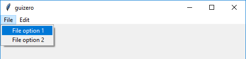
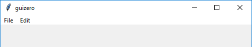

# MenuBar

(Contains a `tkinter.Menu` object)

`__init__(self, master, toplevel, options)`

### What is it?
The `MenuBar` object displays a menu at the top of the screen, with each menu option leading to a submenu.



### How do I make one?

Create a `MenuBar` object like this:

```python
from guizero import App, MenuBar
def file_function():
    print("File option")

def edit_function():
    print("Edit option")

app = App()
menubar = MenuBar(app,
                  toplevel=["File", "Edit"],
                  options=[
                      [ ["File option 1", file_function], ["File option 2", file_function] ],
                      [ ["Edit option 1", edit_function], ["Edit option 2", edit_function] ]
                  ])
app.display()
```


### Starting parameters

When you create a `MenuBar` object you **must** specify all of the parameters.

| Parameter | Takes | Default | Compulsory | Description                         |
| --------- | --------- | ------- | ---------- | -------------------------|
| master    | App   | - | Yes       | The container to which this widget belongs
| toplevel   | list    | -  | Yes         | A list of top level menu items |
| options | 3D list | - | Yes   | A list of submenus, with each submenu being a list of options and each option being a text/command pair. See notes above for more details. |

The `toplevel` parameter should be a list of options you wish to display on the menu. In the example, the `toplevel` options are File and Edit:



The options parameter should be a 3D List containing lists of submenu items, which are themselves lists. The elements in the list correspond to the elements in the `toplevel` list, so the first list of submenu items provided in `options` will be the submenu for the first menu heading provided in `toplevel` and so on.

The menu item sub-sublists within `options` should contain pairs consisting of the text to display on the menu and the function to call when that option is selected. In this example, the text "File option 1" is displayed and the function `file_function` is called if this option is clicked on.

```python
["File option 1", file_function]
```

The MenuBar is never displayed on a grid so there are no grid or alignment parameters.

### Methods

You can call the following methods on an `MenuBar` object.

| Method        | Takes     | Returns    | Description                |
| ------------- | ------------- | ---------- | -------------------------- |
| after(time, command)   | time (int), command (function name)   | -          | Schedules a **single** call to `command` after `time` milliseconds. (To repeatedly call the same command, use `repeat()`)  |
| cancel(command)   | command (function name) | -          | Cancels a scheduled call to `command`    |
| destroy()   | -  | -          | Destroys the widget    |
| focus()  | -  | -          | Gives focus to the widget (e.g. focusing a `TextBox` so that the user can type inside it)  |
| repeat(time, command)  | time (int), command (function name)  | -          | Repeats `command` every `time` milliseconds. This is useful for scheduling a function to be regularly called, for example updating a value read from a sensor.   |


### Properties

You can set and get the following properties:

| Method        | Data type   | Description                |
| ------------- | ----------- | -------------------------- |
| master       | App     | The `App` object to which this MenuBar belongs |
