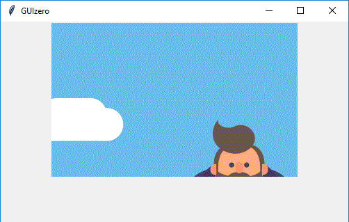

# Picture

(Contains a `tkinter.Label` object)

`__init__(self, master, image, grid=None, align=None)`

### What is it?
The `Picture` object displays a GIF image



### How do I make one?

Create a `Picture` object like this:

```python
from guizero import App, Picture
app = App()
picture = Picture(app, image="test.gif")
app.display()
```
You must specify the correct path to the image. The image in the example is in the same directory as the program. If the image is in a different directory, specify a relative path, for example if the picture is in a subfolder called **images** you would write:

```python
picture = Picture(app, image="images/test.gif")
```
### Starting parameters

When you create a `Picture` object you **must** specify `master` and `image` and you can specify any of the optional parameters. Specify parameters in the brackets, like this: `picture = Picture(app, image="test.gif")`

| Parameter | Takes | Default | Compulsory | Description                         |
| --------- | --------- | ------- | ---------- | -------------------------|
| master    | App or Box   | - | Yes       | The container to which this widget belongs
| image   | List    | -  | Yes         | The path to the image file you wish to display |
| align   | string     | None     | -         | Alignment of this widget within its grid location. Possible values: `"top"`, `"bottom"`, `"left"`, `"right"`. This parameter is only required if the `master` object has a grid layout.  |
| grid   | List [int, int]   | None     | -         | `[x,y]` coordinates of this widget. This parameter is only required if the `master` object has a grid layout. |


### Methods

You can call the following methods on a `Picture` object.

| Method        | Takes     | Returns    | Description                |
| ------------- | ------------- | ---------- | -------------------------- |
| after(time, command)   | time (int), command (function name)   | -          | Schedules a **single** call to `command` after `time` milliseconds. (To repeatedly call the same command, use `repeat()`)  |
| cancel(command)   | command (function name) | -          | Cancels a scheduled call to `command`    |
| destroy()   | -  | -          | Destroys the widget    |
| disable()  | - | -          | Disables the widget so that it is "greyed out" and cannot be interacted with   |
| enable()  | -  | -          | Enables the widget   |
| focus()  | -  | -          | Gives focus to the widget (e.g. focusing a `TextBox` so that the user can type inside it)  |
| hide()  | -   | -          | Hides the widget from view. This method will unpack the widget from the layout manager.   |
| repeat(time, command)  | time (int), command (function name)  | -          | Repeats `command` every `time` milliseconds. This is useful for scheduling a function to be regularly called, for example updating a value read from a sensor.   |
| show()  | - | -          | Displays the widget if it was previously hidden  |
| _set(image)_  | _image (string)_  | -         | _Replaced by the `value` property_ |

Methods in _italics_ will still work but are **deprecated** - this means you should stop using them because they may not work in future versions of guizero

### Properties

You can set and get the following properties:

| Method        | Data type   | Description                |
| ------------- | ----------- | -------------------------- |
| align         | string      | The alignment of this widget within its grid location |
| enabled       | boolean     | `True` if the widget is enabled |
| grid          | List        | `[x,y]` coordinates of this widget. This parameter is only required if the `master` object has a grid |
| master        | App or Box  | The container to which this widget belongs |
| value         | string      | The filename of the image  |
| visible       | boolean     | If this widget is visible |

Refer to a property as `<name of widget>.property`. For example, if your `Picture` object is called `picture` you would write `picture.value`.

You can **set** the property (for example `picture.value = "star.gif"`) or **get** the value of the property to use (for example `print(picture.value)`).
