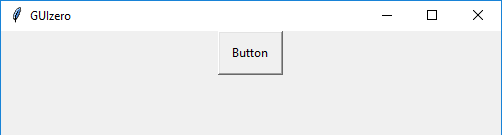

# PushButton

(Contains a `tkinter.Button` object)

`__init__(self, master, command, args=None, text="Button", icon=None, pady=10, padx=10, grid=None, align=None)`

### What is it?
The `PushButton` object displays a button with text or an image, which calls a function when pressed.



### How do I make one?

Create a `PushButton` object like this:

```python
from guizero import App, PushButton
def do_nothing():
  print("Button was pressed")

app = App()
button = PushButton(app, command=do_nothing)
app.display()
```

### Starting parameters

When you create a `PushButton` object you **must** specify `master` and `command` and you can specify any of the optional parameters. Specify parameters in the brackets, like this: `button = PushButton(app, command=do_nothing)`

| Parameter | Takes | Default | Compulsory | Description                         |
| --------- | --------- | ------- | ---------- | -------------------------|
| master    | App or Box   | - | Yes       | The container to which this widget belongs |
| command | function name | - | Yes  | The name of a function to call when the button is pressed. |
| align   | string     | None     | -         | Alignment of this widget within its grid location. Possible values: `"top"`, `"bottom"`, `"left"`, `"right"`. This parameter is only required if the `master` object has a grid layout.  |
| args    | list  | None | -       | If you wish to pass any arguments to the function specified in the command parameter, you can specify them as a list |
| grid   | List [int, int]   | None     | -         | `[x,y]` coordinates of this widget. This parameter is only required if the `master` object has a grid layout. |
| icon    | string   | None | -       | The path to a GIF image file to display on the button. If both an icon and text are specified, the image will override the text. |
| padx    | int   | 10 | -     | How much horizontal padding to add between the text/icon and the edge of the button. |
| pady    | int   | 10 | -       | How much vertical padding to add between the text/icon and the edge of the button. |
| text    | string   | "Button" | -       | The text to display on the button |


### Methods

You can call the following methods on a `PushButton` object.

| Method        | Takes     | Returns    | Description                |
| ------------- | ------------- | ---------- | -------------------------- |
| after(time, command)   | time (int), command (function name)   | -          | Schedules a **single** call to `command` after `time` milliseconds. (To repeatedly call the same command, use `repeat()`)  |
| cancel(command)   | command (function name) | -          | Cancels a scheduled call to `command`    |
| change_command(newcommand, args)  | newcommand (function name), args (list)  | -          | Sets the function called when the button is pressed to the one specified as `newcommand`. You can optionally specify new `args` as a list. |
| destroy()   | -  | -         |  Destroys the widget    |
| disable()  | - | -         |  Disables the widget so that it is "greyed out" and cannot be interacted with   |
| enable()  | -  | -         |  Enables the widget   |
| focus()  | -  | -         |  Gives focus to the widget   |
| hide()  | -   | -          | Hides the widget from view. This method will unpack the widget from the layout manager.   |
| icon(icon) | icon (string) | - |  Sets the image displayed on the button to the filename specified. If the image is in a different directory, you must specify the relative path. |
| padding(padx, pady) | padx (int), pady(int) | - |  Sets the amount of x (horizontal) and y (vertical) padding between the text/icon and the edge of the button |
| repeat(time, command)  | time (int), command (function name)  | -          | Repeats `command` every `time` milliseconds. This is useful for scheduling a function to be regularly called, for example updating a value read from a sensor.   |
| show()  | - | -          | Displays the widget if it was previously hidden  |
| toggle() | - | - |  Changes the state of the button to the opposite of its current state - if it is currently enabled, disable it and vice versa. |
| _set_text(text)_   | _text (string)_         | -         | _Replaced by the `text` property_  |
| _toggle_state()_ | - | - |  _Renamed to `toggle()`_ |


Methods in _italics_ will still work but are **deprecated** - this means you should stop using them because they may not work in future versions of guizero

### Properties

You can set and get the following properties:

| Method        | Data type   | Description                |
| ------------- | ----------- | -------------------------- |
| align         | string      | The alignment of this widget within its grid location |
| bg            | string      | The background colour of the button  |
| enabled       | boolean     | `True` if the widget is enabled |
| font          | string      | The font of the text on the button  |
| grid          | List        | `[x,y]` coordinates of this widget. This parameter is only required if the `master` object has a grid |
| height        | int         | The height of the button  |
| master        | App or Box  | The container to which this widget belongs |
| text          | string      | The text on the button  |
| text_color    | string      | The colour of the text on the button  |
| text_size     | int         | The size of the text on the button  |
| value         | int         | Returns 1 when the button is pressed, 0 if the button is released  |
| visible       | boolean     | If this widget is visible |
| width         | int         | The width of the button  |

**NOTE:** The height and width are currently measured in 'characters' so if you change the font size, this will change the size of the button. **This may change in a future version of guizero.**

Refer to a property as `<name of widget>.property`. For example, if your `PushButton` object is called `button` you would write `button.value`.

You can **set** the property (for example `button.bg = "red"`) or **get** the value of the property to use (for example `print(button.bg)`).
