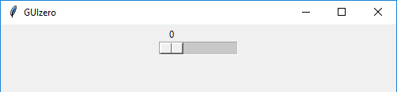
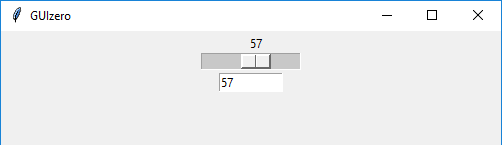

# Slider

```python
__init__(
    self, 
    master, 
    start=0, 
    end=100, 
    horizontal=True, 
    command=None, 
    grid=None, 
    align=None, 
    visible=True, 
    enabled=None, 
    width=None, 
    height=None)
```

### What is it?
The `Slider` object displays a bar and selector which can be used to specify a value in a range.

The above code looks like this on Windows:


### How do I make one?

Create a `Slider` object like this:

```python
from guizero import App, Slider
app = App()
slider = Slider(app)
app.display()
```

### Starting paramters

When you create a `Slider` object, you **must** specify a `master` and you can specify any of the the optional parameters. Specify parameters in the brackets, like this: `slider = Slider(app, horizontal=False)`

| Parameter  | Takes              | Default | Compulsory | Description                                                                                                     |
|------------|--------------------|---------|------------|-----------------------------------------------------------------------------------------------------------------|
| master     | App, Window or Box | -       | Yes        | The container to which this widget belongs                                                                      |
| align      | string             | None    | -          | Alignment of this widget within its container. Possible values: `"top"`, `"bottom"`, `"left"`, `"right"`.       |
| command    | function name      | None    | -          | The name of a function to call when the slider value is changed                                                 |
| end        | int                | 100     | -          | The largest value selectable on the slider                                                                      |
| grid       | List [int, int]    | None    | -          | `[x,y]` coordinates of this widget. This parameter is only required if the `master` object has a grid layout.   |
| horizontal | Boolean            | True    | -          | Whether you wish to display your slider horizontally or vertically (defaults to horizontal)                     |
| start      | int                | 0       | -          | The smallest value selectable on the slider                                                                     |
| visible    | boolean            | True    | No         | If the widget should be visible.                                                                                |
| enabled    | boolean            | None    | No         | If the widget should be enabled. If `None` (the default) the enabled property will be inherited from the master |
| width      | [size](size.md)    | None    | No         | Set the width of the widget in pixels or to `"fill"`                                                            |
| height     | [size](size.md)    | None    | No         | Set the height of the widget in pixels or to `"fill"`                                                           |


### Methods

You can call the following methods on a `Slider` object.

| Method                              | Takes                                                         | Returns | Description                                                                                                                                                    |
|-------------------------------------|---------------------------------------------------------------|---------|----------------------------------------------------------------------------------------------------------------------------------------------------------------|
| the function specified in `command` |                                                               |         |                                                                                                                                                                |
| after(time, command, args=None)     | time (int), command (function name), args (list of arguments) | -       | Schedules a **single** call to `command` after `time` milliseconds. (To repeatedly call the same command, use `repeat()`)                                      |
| cancel(command)                     | command (function name)                                       | -       | Cancels a scheduled call to `command`                                                                                                                          |
| destroy()                           | -                                                             | -       | Destroys the widget                                                                                                                                            |
| disable()                           | -                                                             | -       | Disables the widget so that it is "greyed out" and cannot be interacted with                                                                                   |
| enable()                            | -                                                             | -       | Enables the widget                                                                                                                                             |
| focus()                             | -                                                             | -       | Gives focus to the widget (e.g. focusing a `TextBox` so that the user can type inside it)                                                                      |
| hide()                              | -                                                             | -       | Hides the widget from view. This method will unpack the widget from the layout manager.                                                                        |
| repeat(time, command, args=None)    | time (int), command (function name), args (list of arguments) | -       | Repeats `command` every `time` milliseconds. This is useful for scheduling a function to be regularly called, for example updating a value read from a sensor. |
| resize(width, height)               | width (int), height (int)                                     | -       | Sets the width and height of the widget                                                                                                                        |
| show()                              | -                                                             | -       | Displays the widget if it was previously hidden                                                                                                                |
| update_command(command)             | command (function name)                                       | -       | Updates the function to call when the slider value is changed                                                                                                  |


### Properties

You can set and get the following properties:

| Method     | Data type          | Description                                                                                           |
|------------|--------------------|-------------------------------------------------------------------------------------------------------|
| align      | string             | The alignment of this widget within its container                                                     |
| bg         | [color](colors.md) | The background colour of the widget                                                                   |
| enabled    | boolean            | `True` if the widget is enabled                                                                       |
| font       | string             | The font of the text                                                                                  |
| grid       | List               | `[x,y]` coordinates of this widget. This parameter is only required if the `master` object has a grid |
| height     | [size](size.md)    | Set the height of the widget in pixels or to `"fill"`                                                 |
| master     | App or Box         | The container to which this widget belongs                                                            |
| text_size  | int                | The size of the text                                                                                  |
| text_color | [color](colors.md) | The colour of the text                                                                                |
| tk         | tkinter.Scale      | The internal tkinter object, see [Using tkinter](usingtk.md)                                          |
| value      | string             | The current value of the slider                                                                       |
| visible    | boolean            | If this widget is visible                                                                             |
| width      | [size](size.md)    | Set the width of the widget in pixels or to `"fill"`                                                  |

### Examples

**Calling a function when the slider value changes**

You can specify a function to call when the slider value changes. Your function **MUST** have a minimum of one parameter as it will automatically receive a string containing the value of the slider (called `slider_value` in the example) when it is called.

This code has a slider and a text box, and the text box updates automatically to display the current value of the slider.



```python
from guizero import App, Slider, TextBox
def slider_changed(slider_value):
    textbox.value = slider_value

app = App()
slider = Slider(app, command=slider_changed)
textbox = TextBox(app)
app.display()
```
