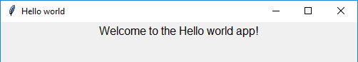
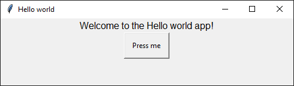

# Getting Started

After you have [installed guizero](index.md) you are ready to create your GUI with guizero.

This is a quick start guide, for more information see [Using Widgets](usingwidgets.md)

### Hello World

Let's create an app window with the title "Hello world" and display it.

```python
from guizero import App

app = App(title="Hello world")

app.display()
```

Save and run the code - you've created your first guizero app!

### Add some text

To add things to your app you will need to [use widgets](usingwidgets.md). 

Use the [Text](text.md) widget to add a message to your app. 



```python
from guizero import App, Text

app = App(title="Hello world")

message = Text(app, text="Welcome to the Hello world app!")

app.display()
```

The `text` parameter of the `TextBox` sets the text that will be displayed on the GUI.

### Make something happen

You can make your app *do things* by using other [widgets](widgetoverview.md) which a user can interact with.

Use the [PushButton](pushbutton.md) widget to create a button which will change the `message` when it is clicked.



```python
from guizero import App, Text, PushButton

def change_message():
    message.value = "You pressed the button!"

app = App(title="Hello world")

message = Text(app, text="Welcome to the Hello world app!")

button = PushButton(app, text="Press me", command=change_message)

app.display()
```

The `PushButton` widget includes a `command` parameter which is set to the name of a function - `change_message`. 

The `change_message` function is called each time the button is clicked.

And that's it! Take a look at [Using Widgets](usingwidgets.md) for more information on how to use guizero. 
