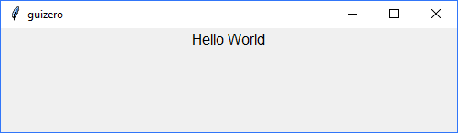

# Text

(Contains a `tkinter.Label` object)

`__init__(self, master, text="", size=12, color="black", text_color=None, bg=None, font="Helvetica", grid=None, align=None)`

### What is it?
The `Text` object displays non editable text in your app, useful for titles, labels and instructions.



### How do I make one?

Create a `Text` object like this:

```python
from guizero import App, Text
app = App()
text = Text(app, text="Hello World")
app.display()
```

### Starting parameters

When you create a `Text` object, you **must** specify a `master` and you can specify any of the the optional parameters. Specify parameters in the brackets, like this: `text = Text(app, text="hi")`

| Parameter | Data type | Default | Compulsory | Description                         |
| --------- | --------- | ------- | ---------- | -------------------------|
| master    | App or Box   | - | Yes       | The container to which this widget belongs |
| align   | string     | None    | -         | Alignment of this widget within its grid location. Possible values: `"top"`, `"bottom"`, `"left"`, `"right"`. This parameter is only required if the `master` object has a grid layout.  |
| color   | string     | black     | -         | The colour of the text. Accepts some colour strings (e.g. `red`) and colours specified in hex format (e.g. `#0099ff`)  |
| font   | string     | "Helvetica"     | -         | The font face that the text will be displayed in. Availability of fonts depends on which fonts are installed locally. |
| grid   | List [int, int]   | None     | -         | `[x,y]` coordinates of this widget. This parameter is only required if the `master` object has a grid layout. |
| size   | int    | 12     | -         | The font size of the text |
| text   | string    | ""  | -         | The text you want to display |


### Methods

You can call the following methods on a `Text` object..

| Method        | Takes     | Returns    | Description                |
| ------------- | ------------- | ---------- | -------------------------- |
| after(time, command)   | time (int), command (function name)   | -          | Schedules a **single** call to `command` after `time` milliseconds. (To repeatedly call the same command, use `repeat()`)  |
| append(text)  | text (string) | -          | Adds the provided `text` to the end of the current text within the object |
| cancel(command)   | command (function name) | -          | Cancels a scheduled call to `command`    |
| clear()   | -             | -          | Clears the text            |
| destroy()   | -  | -          | Destroys the widget    |
| disable()  | - | -          | Disables the widget so that it is "greyed out" and cannot be interacted with   |
| enable()  | -  | -          | Enables the widget   |
| focus()  | -  | -          | Gives focus to the widget   |
| hide()  | -   | -          | Hides the widget from view. This method will unpack the widget from the layout manager.   |
| repeat(time, command)  | time (int), command (function name)  | -          | Repeats `command` every `time` milliseconds. This is useful for scheduling a function to be regularly called, for example updating a value read from a sensor.   |
| show()  | - | -          | Displays the widget if it was previously hidden   |
| _color(color)_ | _color (string)_ | -      | _Replaced by `text_color` property_ |
| _font_face(font)_ | font (string) | - | _Replaced by `font` property_ |
| _font_size(size)_ | size (int) | - |  _Replaced by `size` property_ |
| _get()_ | - | string |  _Replaced by `value` property_ |
| _set(text)_ | text (string) | - |  _Replaced by `value` property_ |

Methods in _italics_ will still work but are **deprecated** - this means you should stop using them because they may not work in future versions of guizero


### Properties

You can set and get the following properties:

| Method        | Data type   | Description                |
| ------------- | ----------- | -------------------------- |
| align         | string      | The alignment of this widget within its grid location |
| bg            | string      | The background colour  |
| enabled       | boolean     | `True` if the widget is enabled |
| font          | string      | The font of the text  |
| grid          | List        | `[x,y]` coordinates of this widget. This parameter is only required if the `master` object has a grid |
| master        | App or Box  | The container to which this widget belongs |
| size          | int         | The size of the text  |
| text_color    | string      | The colour of the text  |
| value         | string      | The text   |
| visible       | boolean     | If this widget is visible |
