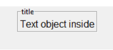
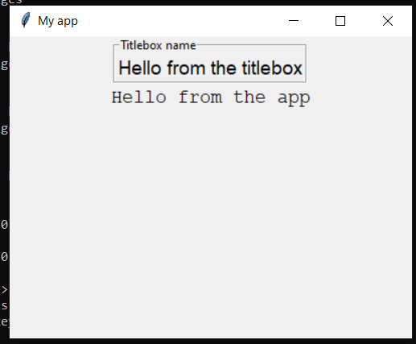
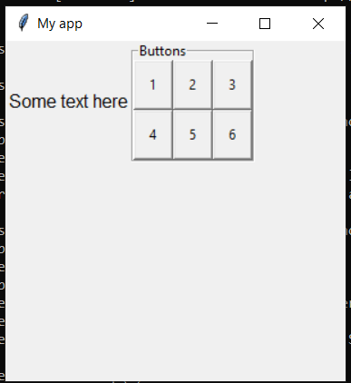

# TitleBox

```python
__init__(
    self,
    master,
    text,
    layout="auto",
    grid=None,
    align=None,
    visible=True,
    enabled=None,
    width=None,
    height=None,
    border=2)
```

### What is it?
The `TitleBox` object is an visible container which can group together other widgets within a border and show the group title. It is the only object other than `App`, `Box`, and `Window` which can act as the `master` for other objects and can have its own layout manager.

You can use the `TitleBox` object to group other objects within your GUI.



### How do I make one?

Create a `TitleBox` object like this:

```python
from guizero import App, TitleBox
app = App()
titlebox = TitleBox(app, "title")
app.display()
```

### Starting parameters

When you create a `TitleBox` object you **must** specify a master and a title, and you can specify any of the optional parameters. Specify parameters in the brackets like this: `titlebox = TitleBox(app, "group name", layout="grid")`

| Parameter | Data type          | Default | Compulsory | Description                                                                                                     |
|-----------|--------------------|---------|------------|-----------------------------------------------------------------------------------------------------------------|
| master    | App, Window or Box | -       | Yes        | The container to which this widget belongs                                                                      |
| text      | string             | -       | Yes        | The text to display as the box name                                                                             |
| align     | string             | None    | -          | Alignment of this widget within its container. Possible values: `"top"`, `"bottom"`, `"left"`, `"right"`.       |
| grid      | List               | None    | -          | `[x,y]` coordinates of this widget. This parameter is only required if the `master` object has a grid layout.   |
| layout    | string             | "auto"  | -          | Whether widgets *inside this box* pack themselves (`"auto"`) or you specify their position on a grid (`"grid"`) |
| visible   | boolean            | True    | No         | If the widget should be visible.                                                                                |
| enabled   | boolean            | None    | No         | If the widget should be enabled. If `None` (the default) the enabled property will be inherited from the master |
| width     | [size](size.md)    | None    | No         | Set the width of the widget in pixels or to `"fill"`                                                            |
| height    | [size](size.md)    | None    | No         | Set the height of the widget in pixels or to `"fill"`                                                           |
| border    | int                | None    | No         | Sets the border thickness. `0` or `False` is no border. `True` or value > 1 sets a border.                      |


### Methods

You can call the following methods on a `TitleBox` object.

| Method                                                                                               | Takes                                                                                               | Returns | Description                                                                                                                                                    |
|------------------------------------------------------------------------------------------------------|-----------------------------------------------------------------------------------------------------|---------|----------------------------------------------------------------------------------------------------------------------------------------------------------------|
| add_tk_widget(tk_widget, grid=None, align=None, visible=True, enabled=None, width=None, height=None) | tk_widget (tk), grid (list), align (str), visible (bool), enabled (bool), width (int), height (int) | Widget  | Adds a tk widget into a guizero container. Note - this is an advanced feature see [Using tk](usingtk.md) for more information.                                 |
| after(time, command, args=None)                                                                      | time (int), command (function name), args (list of arguments)                                       | -       | Schedules a **single** call to `command` after `time` milliseconds. (To repeatedly call the same command, use `repeat()`)                                      |
| cancel(command)                                                                                      | command (function name)                                                                             | -       | Cancels a scheduled call to `command`                                                                                                                          |
| disable()                                                                                            | -                                                                                                   | -       | Disables all the widgets in the box so that they cannot be interacted with                                                                                     |
| destroy()                                                                                            | -                                                                                                   | -       | Destroys the widget                                                                                                                                            |
| enable()                                                                                             | -                                                                                                   | -       | Enables all the widgets in the box                                                                                                                             |
| focus()                                                                                              | -                                                                                                   | -       | Gives focus to the widget (e.g. focusing a `TextBox` so that the user can type inside it)                                                                      |
| hide()                                                                                               | -                                                                                                   | -       | Hides the widget from view. This method will unpack the widget from the layout manager.                                                                        |
| repeat(time, command, args=None)                                                                     | time (int), command (function name), args (list of arguments)                                       | -       | Repeats `command` every `time` milliseconds. This is useful for scheduling a function to be regularly called, for example updating a value read from a sensor. |
| resize(width, height)                                                                                | width (int), height (int)                                                                           | -       | Sets the width and height of the widget                                                                                                                        |
| show()                                                                                               | -                                                                                                   | -       | Displays the widget if it was previously hidden                                                                                                                |


### Properties

You can set and get the following properties:

| Method   | Data type          | Description                                                                                           |
|----------|--------------------|-------------------------------------------------------------------------------------------------------|
| align    | string             | The alignment of this widget within its container                                                     |
| border   | int                | The border thickness, setting to `0` or `False` there is no border.                                   |
| bg       | [color](colors.md) | The background colour of the widget                                                                   |
| children | List               | A list of widgets in this container                                                                   |
| enabled  | boolean            | `True` if the box is enabled                                                                          |
| grid     | List               | `[x,y]` coordinates of this widget. This parameter is only required if the `master` object has a grid |
| font     | string             | The font that widgets should use                                                                      |
| height   | [size](size.md)    | Set the height of the widget in pixels or to `"fill"`                                                 |
| layout   | string             | The layout being used by the Box (`"auto"`) or (`"grid"`)                                             |
| master   | App                | The `App` object to which this box belongs                                                            |
| text     | string             | The text that should be displayed as the title of the box                                             |
| tk       | tkinter.Frame      | The internal tkinter object, see [Using tkinter](usingtk.md)                                          |
| visible  | boolean            | If this widget is visible                                                                             |
| width    | [size](size.md)    | Set the width of the widget in pixels or to `"fill"`                                                  |

### Examples

**Putting widgets in a TitleBox**

The `TitleBox` object is a visible container which can group together other widgets within a border and show the group title
In this example, there are two `Text` objects. One has `titlebox` as its master, the other has `app` as its master.

```python
from guizero import App, TitleBox, Text
app = App(title="My app", height=300, width=400)
titlebox = TitleBox(app, text="Titlebox name")
text1 = Text(titlebox, text="Hello from the titlebox", size=14, font="Arial")
text2 = Text(app, text="Hello from the app", size=14, font="Courier New")
app.display()
```



**Grouping objects within a TitleBox**

It is useful to put objects in a titlebox to group them together and give them a title. For example here we have given the `app` a grid layout, then placed some text at [0,0] and the `TitleBox` object at [1,0]. This means that the text will appear on the left, and the contents of the TitleBox will appear on the right.

The `TitleBox` object itself has a grid layout and contains six buttons which are positioned on a *separate* grid layout belonging to the box.

```python
from guizero import App, Text, TitleBox, PushButton
def do_nothing():
    return 0

app = App(title="My app", height=300, width=300, layout="grid")
text = Text(app, text="Some text here", grid=[0,0])
titlebox = TitleBox(app, text="Buttons", layout="grid", grid=[1,0])
button1 = PushButton(titlebox, command=do_nothing, text="1", grid=[0,0])
button2 = PushButton(titlebox, command=do_nothing, text="2", grid=[1,0])
button3 = PushButton(titlebox, command=do_nothing, text="3", grid=[2,0])
button4 = PushButton(titlebox, command=do_nothing, text="4", grid=[0,1])
button5 = PushButton(titlebox, command=do_nothing, text="5", grid=[1,1])
button6 = PushButton(titlebox, command=do_nothing, text="6", grid=[2,1])
app.display()

```

