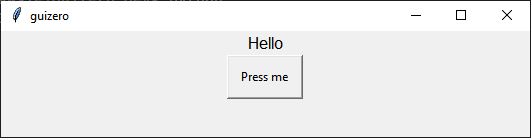
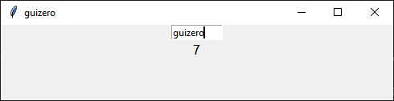

# Using Widgets

[Widgets](widgetoverview.md) are how you create your GUI. They are the things which appear on the GUI, everything from the app itself to text boxes, buttons and pictures.

At the start of every guizero program, choose the widgets you need from the guizero library and import them e.g.

```python
from guizero import App, Text, PushButton, Slider
```

You only need to import each widget once, and then you can use it in your program as many times as you like.

### The App widget

Every guizero app will need an [App](app.md) widget. This is the main window.

At the end of every guizero program you must tell the program to `display` the app you have just created.

```python
from guizero import App

app = App(title="My guizero app")

app.display()
```

### Adding widgets

All the text boxes, buttons, sliders and even plain old pieces of text which appear on your GUI are widgets.

**All widgets** go between the line of code to create the `App` and the `app.display()` line.

```python
from guizero import App, Text, TextBox

app = App(title="Whats your name?")

# create widgets here
message = Text(app, text="Enter your name")
name = TextBox(app)

app.display()
```

Let’s look at the [Text](text.md) widget code in a bit more detail:

```python
message = Text(app, text="Enter your name"))
```

- `message =` - The `Text` object has a name, just like any variable
- `Text` - an *object* which creates a piece of text on the screen
- `app` – This tells the `Text` where it will live. Most of the time your widgets will live directly inside the app.
- `text="Enter your name"` - The text to display


Have a look at [Widget overview](widgetoverview.md) to see all the widgets, find out more about them and how they are used.

### Using events

An event is how you trigger code as a result of users interacting with your app. An example of an event could be a user clicking on a button or entering text into a TextBox. When an event occurs you can run a piece of code. 

This is how you make your app "do stuff".

Widgets which can be interacted with can accept a `command` parameter. You can set the `command` parameter to be the name of a function which will be called when the widget is used.

In this example the function `say_hello` is called when a [PushButton](pushbutton.md) is pressed.

~~~python
from guizero import App, PushButton, Text

def say_hello():
    message.value = "Hello"

app = App()
message = Text(app)
button = PushButton(app, text="Press me", command=say_hello)

app.display()
~~~



In this example the `command` parameter of a [TextBox](textbox.md) widget is used to call the `count` function which displays how many characters have been entered.

~~~python
from guizero import App, TextBox, Text

def count():
    character_count.value = len(entered_text.value)

app = App()
entered_text = TextBox(app, command=count)
character_count = Text(app)

app.display()
~~~



### Controlling widgets

The status of a widget can be controlled. This allows you to control how an app is used e.g. Only allowing the submit button of a form to be used when all the data has been entered

You can control whether a widget is:

+ shown
+ hidden
+ enabled
+ disabled

A widget will only appear on an app if it is visible. The widget can only be interacted with (used) if it is enabled.

In this example [PushButton](pushbutton.md) widgets are used to change the status of a [TextBox](textbox.md) widget by calling the text box's `show`, `hide`, `disable` and `enable` methods.

~~~python
from guizero import App, PushButton, TextBox

def show():
    text_box.show()

def hide():
    text_box.hide()

def enable():
    text_box.enable()

def disable():
    text_box.disable()

app = App()

text_box = TextBox(app)

show_button = PushButton(app, text="show", command=show)
hide_button = PushButton(app, text="hide", command=hide)
enable_button = PushButton(app, text="enable", command=enable)
disable_button = PushButton(app, text="disable",command=disable)

app.display()
~~~

### Destroying widgets

Widgets can be destroyed (removed) from an application by using the `destroy` method. 

Once a widget has been destroyed it cannot be used or referenced again. An error will be raised when trying to call a destroyed widget.

~~~python
from guizero import App, PushButton, Text

def destroy_message():
    message.destroy()

app = App()
message = Text(app, text="Destroy me!")
destroy_button = PushButton(app, text="Destroy", command=destroy_message)

app.display()
~~~

**Warning** - destroying a widget in an uncontrolled way could make your application unstable. A widget's code will stop immediately regardless of what your application is doing. It is often to simpler and safer to hide or disable a widget rather than destroy it.