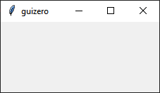
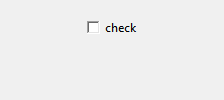
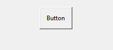
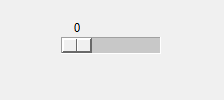
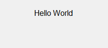
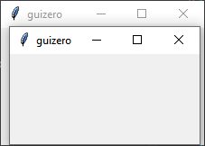

# Overview

Widgets are how you create your GUI. They are the things which appear on the GUI, everything from the app itself to text boxes, buttons and pictures.

**Note:** This is an overview of the widgets in guizero. Be sure to view the specific documentation for each widget for more information.

## Widgets

### [App](app.md)

The App object is the basis of all GUIs created using guizero. It is the main window which contains all of the other widgets.

[](app.md)

```python
app = App()
app.display()
```

### [Box](box.md)

The `Box` object is an invisible container which can contain other widgets.

[](box.md)

```python
box = Box(app)
box = Box(app, border=True)
```

### [ButtonGroup](buttongroup.md)

The `ButtonGroup` object displays a group of radio buttons, allowing the user to choose a single option.

[](buttongroup.md)

```python
choice = ButtonGroup(app, options=["cheese", "ham", "salad"])
```

### [CheckBox](checkbox.md)

The `CheckBox` object displays a check box to allow an option to be ticked or un-ticked.

[](checkbox.md)

```python
checkbox = CheckBox(app, text="salad ?")
```

### [Combo](combo.md)

The `Combo` object displays a drop down box allowing a single option to be selected from a list of options.

[](combo.md)

```python
combo = Combo(app, options=["cheese", "ham", "salad"])
```

### [Drawing](drawing.md)

The `Drawing` object allows shapes, images and text to be created.

[](drawing.md)

```python
drawing = Drawing(app)
```

### [ListBox](listbox.md)

The `ListBox` object displays a list of items from which either single or multiple items can be selected.

[](listbox.md)

```python
listbox = ListBox(app, items=["cheese", "ham", "salad"])
```

### [Picture](picture.md)

The `Picture` object displays an image.

[](picture.md)

```python
picture = Picture(app, image="guizero.png")
```

### [PushButton](pushbutton.md)

The `PushButton` object displays a button with text or an image, which calls a function when pressed.

[](pushbutton.md)

```python
def do_nothing():
    print("button pressed")

button = PushButton(app, command=do_nothing)
```

### [Slider](slider.md)

The `Slider` object displays a bar and selector which can be used to specify a value in a range.

[](slider.md)

```python
slider = Slider(app)
```

### [Text](text.md)

The `Text` object displays non editable text in your app, useful for titles, labels and instructions.

[](text.md)

```python
text = Text(app, text="Hello World")
```

### [TextBox](textbox.md)

The `TextBox` object displays a text box which the user can type in.

[](textbox.md)

```python
textbox = TextBox(app)
```

### [Waffle](waffle.md)

The `Waffle` object display an n*n grid of squares with custom dimensions and padding.

[](waffle.md)

```python
waffle = Waffle(app)
```

### [Window](window.md)

The `Window` object create a new window in guizero.

[](window.md)

```python
window = Window(app)
```

## Properties

All widgets are customisable through their properties. These properties are typical for most widgets. Check the widgets document for more information.

| Property   | Data type          | Description                                             |
|------------|--------------------|---------------------------------------------------------|
| align      | string             | The alignment of this widget within its container       |
| bg         | string, List       | The background colour of the widget                     |
| enabled    | boolean            | `True` if the widget is enabled                         |
| font       | string             | The font of the text                                    |
| grid       | List               | `[x,y]` coordinates of this widget if in a "grid".      |
| height     | int, string        | The height of the widget.                               |
| master     | App, Window, Box   | The container to which this widget belongs              |
| value      | int, string, bool  | The widgets current "value", e.g. the text in a TextBox |
| visible    | boolean            | If this widget is visible                               |
| width      | [size](size.md)    | The width of the widget.                                |
| text_size  | int                | The size of the text                                    |
| text_color | [color](colors.md) | The colour of the text                                  |

## Methods

Widgets can be interacted with through their methods. The methods supported are dependent on the widget, so check the documentation. These methods are typical across most widgets. 

| Method                              | Description                                                    |
|-------------------------------------|----------------------------------------------------------------|
| after(time, command, args=None)     | Schedules a single call to `command` after `time` milliseconds |
| cancel(command)                     | Cancels a scheduled call to `command`                          |
| destroy()                           | Destroys the widget                                            |
| disable()                           | Disables the widget so that it cannot be interacted with       |
| enable()                            | Enables the widget                                             |
| focus()                             | Gives focus to the widget                                      |
| hide()                              | Hides the widget from view                                     |
| repeat(time, command, args=None)    | Schedules a call to `command` every `time` milliseconds        |
| resize(width, height)               | Sets the width and height of the widget                        |
| show()                              | Displays the widget if it was previously hidden                |
| update_command(command, args =None) | Updates the function to call when the widget is used           |
