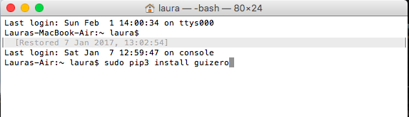

# Installation

guizero is designed to allow children to quickly and easily create GUIs for their programs.

In educational settings (schools, libraries etc.), installation of extra programs and features may be difficult, so the setup process is designed to be as simple as possible. guizero only requires `tkinter` to be installed, and this is already bundled with most Python installations.

The aim is for installation and getting started to be as simple as possible.

### On Windows
The easiest way to install guizero is to use **pip** (follow [this simple guide](http://www.catcatcode.com/blog/installing-python-packages-with-pip) to using pip).

Type the following at a command prompt:

```bash
pip install guizero
```

### On Raspberry Pi
Make sure your Raspberry Pi is connected to the internet, then open a terminal window and type the following:

```bash
sudo pip3 install guizero
```

# On Mac
Open the terminal (you can search for it in the Launch Pad)


Type in the command:

```bash
sudo pip3 install guizero
```

