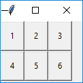
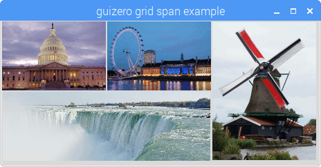

## Layouts

The `App` parameter `layout` allows you to specify whether the widgets in your app are placed automatically (`auto`), or whether you wish to position them yourself on a grid (`grid`). The default layout is `auto`.

If you choose the `grid` layout, this means that when you create a widget (other than the `App` itself) you will need to pass the widget an extra parameter called `grid` which is a list containing `[x,y]` coordinates for where you want the widget to appear, like this:

```python
text = Text(app, text="Hello world", grid=[0,1])
```

There is no need to specify the width or height of the grid you want - it will expand depending on the coordinates you provide with each widget. However, grid cells containing no objects will have no height or width.

**Using grid layout**

You can lay components out in a grid and specify where they appear with grid layout.



```python
from guizero import App, PushButton
def do_nothing():
    print("Nothing happened")

app = App(title="Keypad example", width=100, height=90, layout="grid")
button1 = PushButton(app, command=do_nothing, text="1", grid=[0,0])
button2 = PushButton(app, command=do_nothing, text="2", grid=[1,0])
button3  = PushButton(app, command=do_nothing, text="3", grid=[2,0])
button4  = PushButton(app, command=do_nothing, text="4", grid=[0,1])
button5  = PushButton(app, command=do_nothing, text="5", grid=[1,1])
button6  = PushButton(app, command=do_nothing, text="6", grid=[2,1])
app.display()
```

**Spanning columns or rows**

You can have a widget span multiple columns or rows by specifying those within the grid parameter. These are optional, but if specified both must be included using the format `[x,y,xspan,yspan]`.

The example below shows text widget located at 0,1 spanning two columns (x) and one row (y):

```python
text = Text(app, text="Hello world", grid=[0,1,2,1])
```

This can be used to include widgets of different sizes arranged alongside each other.



Assuming you have four appropriate image files then the code to create this is shown below.

```python
from guizero import App, Picture

app = App(title="guizero grid span example", width=460, height=210, layout="grid")
picture1 = Picture(app, image="std1.gif", grid=[0,0])
picture2 = Picture(app, image="std2.gif", grid=[1,0])
picture3 = Picture(app, image="tall1.gif", grid=[2,0,1,2])
picture4 = Picture(app, image="wide1.gif", grid=[0,1,2,1])

app.display()
```

