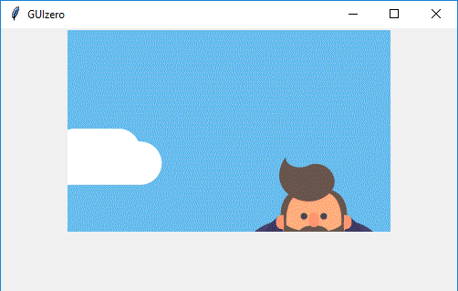

# Picture

(Extends the `Label` class from `tkinter`)

### Purpose
Display a GIF image

```
class guizero.Picture(master, image, grid=None, align=None)
```

### Create a Picture object

Create a basic Picture object like this (assuming your image is called `test.gif` and is saved in the same folder as your Python file)

```python
from guizero import App, Picture
app = App()
picture = Picture(app, image="test.gif")
app.display()
```

You must specify the correct path to the image. The image in the example is in the same directory as the program. If the image is in a different directory, specify a relative path, for example if the picture is in a subfolder called **images** you would write:

```python
picture = Picture(app, image="images/test.gif")
```

The code looks like this on Windows:




When creating a Picture object, you can specify the following parameters. (More information about how to specify parameters can be found in the ['How to...'](./howto/) section.)

| Parameter | Takes | Default | Compulsory | Description                         |
| --------- | --------- | ------- | ---------- | -------------------------|
| master    | App or Box   | - | Yes       | The container to which this widget belongs
| image   | List    | -  | Yes         | The path to the image file you wish to display |
| grid   | List [int, int]   | None     | No         | `[x,y]` coordinates of this widget. This parameter is only required if the `master` object has a grid layout. |
| align   | string     | None     | No         | Alignment of this widget within its grid location. Possible values: `"top"`, `"bottom"`, `"left"`, `"right"`. This parameter is only required if the `master` object has a grid layout.  |


### Methods

You can call the following methods on your Picture object

| Method        | Takes     | Returns    | Description                |
| ------------- | ------------- | ---------- | -------------------------- |
| set(image)  | image (string)  |           | Sets the picture displayed to the picture located at the path specified in the string `image`|


### Examples

**Creating a Picture**

The simplest way to create a Picture object is as follows:

```python
from guizero import App, Picture
app = App()
picture = Picture(app, image="test.gif")
app.display()
```
