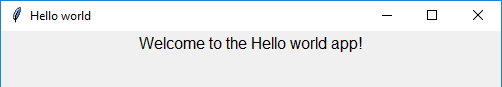

# Getting Started

At the start of every guizero program, choose the widgets you need from the guizero library and import them:

```python
from guizero import App, PushButton, Slider
```

You only need to import each widget once, and then you can use it in your program as many times as you like.

### Hello World

All guizero projects begin with a main window which is called an `App`. At the end of every guizero program you must tell the program to display the app you have just created.

Let's create an app window with the title "Hello world":

```python
from guizero import App
app = App(title="Hello world")
app.display()
```

Save and run the code - you've created your first guizero app!

### Adding widgets

Widgets are the things which appear on the GUI, such as text boxes, buttons, sliders and even plain old pieces of text.

**All widgets** go between the line of code to create the `App` and the `app.display()` line.

```python
from guizero import App, Text
app = App(title="Hello world")
message = Text(app, text="Welcome to the Hello world app!")
app.display()
```


Let’s look at the `Text` widget code in a bit more detail:

```python
message = Text(app, text="Welcome to the Hello world app!")
```

- `message =` - The `Text` object has a name, just like any variable
- `Text` - an *object* which creates a piece of text on the screen
- `app` – This tells the `Text` where it will live. Most of the time your widgets will live directly inside the app.
- `text="Welcome to the Hello world app!"` - The text to display

And that's it! Now have a look on the documentation pages for the individual widgets to find out more about how to use them.
