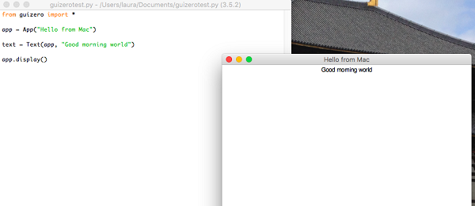

# Getting Started

We believe that it is important for children to be able to use and navigate documentation for themselves, so that their creativity is not limited by the features presented to them. We have provided comprehensive documentation of guizero and would encourage you to share this with children who use the library. Feedback on the accessibility of the documentation is very welcome.

At the start of every guizero program, you need to import the items you need from the guizero library to be able to use its functionality, for example:

```python
from guizero import App
```

Here is how you can import multiple classes at once all on the same line:

```python
from guizero import App, PushButton, Slider```

You only need to import each class once, and then you can use it in your program as many times as you like.

### Hello World

To get started with guizero, you first need to create a main window which is called an App. At the end of every guizero program you must tell the program to display the app you have just created.

Let's create an app window with the title “Hello world”:

```python
from guizero import App

app = App(title="Hello world")
app.display()
```

Save and run the code - you've created your first guizero app!

### Adding widgets

Widgets are the things which appear on the GUI, such as text boxes, buttons, sliders and even plain old pieces of text. Let’s add a text widget to the app.

```python
from guizero import App, Text

app = App(title="Hello world")
message = Text(app, text="Welcome to the Hello world app!")
app.display()
```



There is a new line of code to add a piece of text. Let’s look at this piece of code in a bit more detail:

```python
message = Text(app, text="Welcome to the Hello world app!")
```

- `message =` - This Text object has a name so that you can refer to it later if you want to change its properties
- `Text` - an *object* which creates a piece of text on the screen
- `app` – The first *argument* in the brackets for any widget must be the *master* of this widget, the App or Box where this widget will live
- `"Welcome to the Hello world app!"` - The text to display

You can add as many widgets as you want. Code which creates a widget is always placed in between the line of code where you create the app and the line of code where you display the app.

And that's it! Why not have a look on the documentation pages for the individual widgets to find out more about how to use them?
